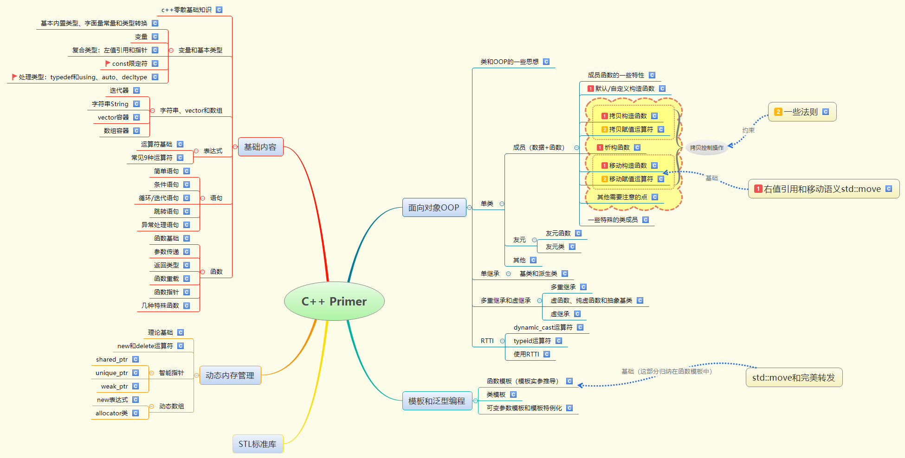

# 一、阅读情况
只有STL部分没有阅读，其他全部看完，整理完毕

思维导图：

# Reference
b站视频: [阿西拜编程-合集·明解 C++ Primer](https://space.bilibili.com/412587130/channel/collectiondetail?sid=303422)

github笔记参考:[C++ Primer 中文版第5版学习仓库-applenobCpp_Primer_Practice](https://github.com/applenob/Cpp_Primer_Practice)