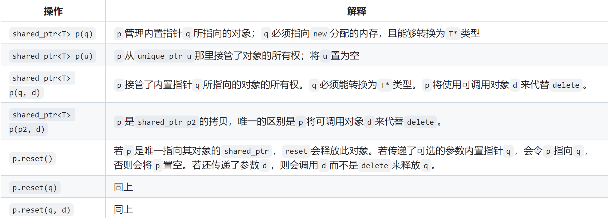

[TOC]
# 第十二章、动态内存
## 12.1、动态内存和智能指针
* 内存类型
    * 编译器自动创建和销毁
        * 静态内存：保存局部static对象、类static数据成员、定义在函数外的变量;
        * 栈内存：保存定义在函数内的非static对象，仅在函数块运行时才会存在;
    * 命周期由程序控制，必须显式的销毁
        * 堆内存：存储动态分配的对象，即那些程序运行时才会被分配的对象;

* 为什么要使用动态内存生成的动态对象：
    * 程序不知道自己需要使用多少对象；
    * 程序不知道所需对象的准确类型;
    * 程序需要在多个对象间共享数据(重点);

* 使用动态内存可能造成问题：
    * 内存泄漏：动态对象使用完了之后，忘记释放动态对象；
    * 产生指向非法内存的指针：*p->a, 释放a对象，再使用p, 报错;

* 管理动态内存的方式
    * c++11以前: 运算符new和delete手动管理
    * c++11以后智能指针（memory头文件）：shared_ptr（允许多个指针指向同一个对象）、unique_ptr（只允许一个指针指向一个对象）、weak_ptr（是一种弱引用，指向shared_ptr所管理的对象）


### 12.1.1、shared_ptr
* 简单使用：智能指针也是模板，因此在使用时必须提供智能指针所指向的类型
    ```cpp
    shared_ptr<string> p1;  // 定义一个共享智能指针p1,指向string对象,该对象为空字符串
    shared_ptr<list<int>> p2; // 定义一个共享智能指针p2,指向int的list对象,list中所有元素都0
    ```
* shared_ptr最安全的使用方法是调用make_shared标准库函数，该函数可以在动态内存中分配一个对象并根据提供的参数初始化这个对象，返回指向这个对象的shared_ptr指针;
    ```cpp
    // 定义一个共享智能指针p3 指向一个值为42的int对象
    shared_ptr<int> p3 = make_shared<int>(42);    
    // 定义一个共享智能指针p4 指向一个值为"999"的string对象
    shared_ptr<string> p4 = make_shared<string>(3, '9');
    // 定义一个共享智能指针p5 指向一个默认值为0的int对象
    shared_ptr<int> p5 = make_shared<int>();
    // auto+make_shared是更常见的一种组合方式，简单有效
    auto p6 = make_shared<string>();
    ```
* shared_ptr的一些常见操作
    * shared_ptr和unique_ptr都支持的操作
        
    * shared_ptr独有的操作
         

* 引用计数
    * 当进行拷贝或赋值操作时，每个对象都会通过引用计数器记录有多少个其他shared_ptr指向当前对象。当拷贝一个shared_ptr时, 引用计数器会增加, 当给shared_ptr赋值一个新值或者shared_ptr被销毁，计数器会递减。
        ```cpp
        auto p = make_shared<int>(42);  // p指向值为42的int对象，引用计数器cnt1=1
        auto p(q);  // p也指向q指向的对象 此时cnt1=0 cnt2=2
        
        // shared_ptr指针r指针指向值为42的int对象
        auto r = make_shared<int>(42);
        // 递增q所指向对象的引用计数器cnt1
        // 递减r原来所指向的对象的引用计数器cnt2 如果cnt2=0 释放r
        r = q;
        ```


* shared_ptr可以自动销毁所管理的对象，还会自动释放相关联的内存
    * 当指向一个对象的最后一个shared_ptr指针被销毁时，shared_ptr会自动通过调用析构函数销毁此对象：析构函数会递减它所指向的对象的引用计数，如果引用计数为0，shared_ptr的析构函数再销毁这个对象;
    * 当动态对象不再使用时，shared_ptr类会自动释放动态对象，如在函数中定义了一个shared_ptr指针，那么当离开这个函数作用域，这个指针所指向内存就会被释放;
        ```cpp
        shared_ptr<int> factory(int arg){
            return make_shared<int>(arg);
        } 
        void use_factory(int arg){
            shared_ptr<int> p = factory(arg);  // 定义shared_ptr指针p
        }  // 当p指针离开函数作用域 p指针被销毁 此时它所指向对象引用计数为0
           // p所指向的动态对象也会被销毁  动态对象所占用的内存也被自动释放掉
        ```

### 12.1.2、new和delete运算符直接管理内存
* new运算符负责动态分配内存，delete运算符负责释放掉new分配的内存，但是这两个运算符管理内存会非常容易出错，建议尽量使用智能指针管理内存。
* new和delete管理动态内存存在的三个问题
    * 内存泄漏，即忘记delete内存;
    * 使用已经释放的对象;
    * 同一块内存释放两次：两个指针指相同的动态分配对象时，delete掉其中一个对象并释放掉对应内存，剩下一个指针就变成了空悬指针，再次使用这个空悬指针，第二次释放同一块内存，错误；
* new运算符动态分配和初始化对象
    * 在自由空间分配的内存是无名的，因此new无法为其分配的对象命名，而是返回一个指向该对象的指针;
    * 初始化
        * 默认初始化
            ```cpp
            int *pi = new int;
            string *ps = new string;
            ```
        * 直接初始化
            ```cpp
            int *pi = new int(1024);
            string *ps = new string(10, '9');
            ```
        * 列表初始化
            ```cpp
            vector<int> *pv = new vector<int>{0, 1, 2};
            ```
        * 使用auto从单一初始化器来推断分配对象的类型
            ```cpp
            int i = 0;
            auto p1 = new auto(i);
            auto p2 = new auto{i,j,k};  // 错
            ```
        * new可以分配const对象
            ```cpp
            const int *pci = new const int(1024);
            ```
    * 内存耗尽：自由空间被耗尽导致无法new分配对象所需的内存空间，抛出一个bad_alloc异常，不过nothorw可以阻止抛出异常;
        ```cpp
        int *p1 = new int;  // 如果内存不足 则抛出std::bad_alloc异常
        int *p2 = new (nothrow) int;  // 如果内存不足 则分配失败 返回一个空指针 
        ```

* delete销毁new指针指向的对象并释放对应的内存
    * 例子
        ```cpp
        int i, *pi1, *pi2 = nullptr;
        double *pd = new double(33), *pd2 = pd;
        const int *pci = new const int(1024);
        delete i;     // 错 i不是一个指针
        delete pi1;   // 未定义 pi1不是new出的指针
        delete pd;    // 对
        delete pd2;   // 未定义 pd2和pd同时指向一块内存 pd指向的内存已经被释放了
        delete pi2;   // 对 delete掉一个空指针 
        delete pci;   // 对 释放一个new的const对象
        ```
    * new出来的动态对象直到被显示释放之前都是存在的，所以必须要记得delete释放内存
        ```cpp
        template <typename T>
        Foo* factory(T arg){
            return new Foo(arg)
        }
        template <typename T>
        void use_factory(T arg){
            Foo *p = factory(arg);
            // use p
            delete p;
        }
        ```


### 12.1.3、shared_ptr和new结合使用
* 定义和改变sharted_ptr的其他方法
    
* 使用new返回的普通指针显示的初始化(直接初始化方式)智能指针shared_ptr
    ```cpp
    shared_ptr<double> p1;    // 初始化为一个空指针
    shared_ptr<int> p2(new int(42));   // 对 p2指向一个42的动态地址
    shared_ptr<int> p3 = new int(42);  // 错 必须使用直接初始化方式
    ```
* 默认情况下，一个初始化智能指针的普通指针(new返回的指针)必须指向动态内存
* 永远不要用get初始化另一个智能指针或者为另一个智能指针赋值


### 12.1.4、智能指针和异常
* 使用智能指针需要遵守的一些规范
    * 不使用相同的内置指针初始化多个智能指针
    * 不delete get()返回的指针
    * 不使用get()初始化或reset另一个智能指针
    * 如果使用get()返回的指针，记住当最后一个对应的智能指针销毁后，你的指针就变为无效了
    * 如果使用智能指针管理的资源不是new分配的内存，记住传递给它一个删除器

### 12.1.5、unique_ptr
* unique_ptr独有它所指向的对象，同一时刻一个unique_ptr对象只能指向一个对象，当unique_ptr对象被销毁时，它所指向的对象也被销毁;
* 当定义一个unique_ptr对象时，不需要mask_shared函数，需要将其绑定到一个new返回的指针上，且初始化必须采用直接初始化方式;
    ```cpp
    unique_ptr<double> p1;  // 指向一个double的unique_ptr空指针
    unique_ptr<int> p2(new int(42));  // 指向一个值为42的unique_ptr指针
    unique_ptr<int> p3 = new int(42);  // 错 必须是直接初始化方式
    ```
* unique_ptr独有的操作
    
* 一个unique_ptr独有所指的对象，所以unique_ptr不支持普通的拷贝和赋值操作;
    ```cpp
    unique_ptr<string> p1(new string("hello world"));
    unique_ptr<string> p2(p1);   // 错  unique_ptr不支持拷贝
    unique_ptr<string> p3;
    p3 = p2;   // 错 unique_ptr不支持赋值
    ```
* 例外：可以拷贝或赋值一个将要销毁的unique_ptr;
    ```cpp
    unique_ptr<int> clone1(int p){
        return unique_ptr<int>(new int(p));  // 拷贝给临时变量
    }
    unique_ptr<int> clone2(int p){
        unique_ptr<int> ret(new int(p));  // 拷贝给局部对象
        return ret;
    }
    ```

* 虽然不能拷贝或赋值unique_ptr，但是可以通过调用release或reset函数将指针的所有权从一个(非const)unique_ptr转移给另一个unique_ptr;
    ```cpp
    unique_ptr<string> p1(new string("hello"));
    // p1.release: p1先放弃对"hello"的控制 再返回指向这个空间的指针
    // 将“hello”所有权从p1转移给p2 并将p1置为空 
    unique_ptr<string> p2(p1.release());
    unique_ptr<string> p3(new string("world"));
    // 将”world“的所有权从p3转移给p2  并释放原先p2所指向的内存“hello”
    p2.reset(p3.release());
    // p2.release();  // 错误 会造成内存泄漏
    auto p = p2.release();  // 正确做法
    delete p;  
    ```

### 12.1.6、weak_ptr
* weak_ptr是一种不受控制所指向对象生存期的智能指针，它指向一个shared_ptr，但不会改变shared_ptr的引用计数;
    ```cpp
    auto p = make_shared<int>(42);
    // wp弱共享p, p的引用计数不变
    weak_ptr<int> wp(p);
    ```
* 一旦最后一个指向对象的shared_ptr被销毁，对象就会被释放，不管有没有weak_ptr指向该对象；

* weak_ptr的操作
    


## 12.2、动态数组
* 动态数组不是数组类型，而是返回一个数组元素类型的指针;
* 大多数应用应该使用标准库容器而不是动态分配的数组;
* 两种分配动态数组的方法：new表达式和allocator类
### 12.2.1、new表达式
* new定义动态数组: type *p = new type[size]; 其中size必须是整型，但不必是常量;
    ```cpp
    // new分配一个int动态数组 返回指向第一个int元素的指针
    int *p = new int[4];
    ```
* new动态数组初始化
    * 默认初始化
        ```cpp
        int *pi1 = new int[4];
        string *ps1 = new string[4];
        ```
    * 值初始化
        ```cpp
        int *pi2 = new int[4]();
        string *ps2 = new string[4]();
        ```
    * 列表初始化
        ```cpp
        int *pi3 = new int[10]{0, 1, 2, 3}
        ```
* 可以动态分配一个空数组，但是不能对指针进行解引用;
    ```cpp
    int p1[0];  // 错误
    int *p2 = new int[0];  // 对
    cout << *p2 << endl;   // 错
    ```
* 释放动态数组
    ```cpp
    int *pi = new int[10];
    delete []pi;
    ```
* 智能指针unique_ptr和动态数组
    * 实例
        ```cpp
        unique_ptr<int[]> up(new int[10]);
        up.release();  // 自动用delete[]销毁其指针
        ```
    * 指向数组的unique_ptr操作
        指向数组的unique_ptr不支持成员访问运算符(点和箭头运算符)，其他unique_ptr操作不变
        
    
### 12.2.2、allocator类

* new表达式的缺陷
    * 示例
        ```cpp
        int n = 5;
        string *const p = new string[n];
        string s;
        string *q = p;
        while(cin >> s && q != p+n)
            *q++ = s;
        delete[] p;
        ```
    * 缺点
        * 可能不需要n个string，造成不必要的浪费
        * 每个元素都赋值了两次
        * 没用默认构造函数的类就不能动态分配数组
* allocator类
    * 标准库allocator类定义在头文件memory中，帮助我们将内存分配和对象构造分离开
    * 标准allocator类和算法
        
    * 示例
        ```cpp
        int n = 5;
        allocator<string> alloc;    // 定义一个allocator对象，可以为string对象分配内存
        auto const p = alloc.allocate(n);   //  分配n个未初始化的string
        auto q = p;     
        alloc.construct(q++);   // *q=""、q++
        alloc.construct(q++, 5, 'C');   // *q="CCCCC"、q++
        alloc.construct(q++, "hi");     // *q="hi"、q++
        cout << *p << endl;
        cout << *q << endl;   // 未定义 q指向最后构造的元素之后的位置
        // 删除动态数组
        while(q != p)
            alloc.destroy(--q);   // 隐式调用析构函数 销毁每一个元素
        alloc.deallocate(p, n);   // 释放n个string对象的内存
        ```
* allocator伴随算法
    * 定义在头文件memory中,在给定目的位置创建元素，而不是由系统分配内存给他们
    
    * 示例
        ```cpp
        vector<int> vi = {1, 2, 3};
        allocator<string> alloc;
        auto p = alloc.allocate(vi.size()*2);  // 6个元素空间
        // 前三个空间填充123  q指向第四个空间
        auto q = uninitialized_copy(vi.begin(), vi.end(), p);
        // 后三个空间填充42
        uninitialized_fill_n(q, vi.size(), 42);
        ```


