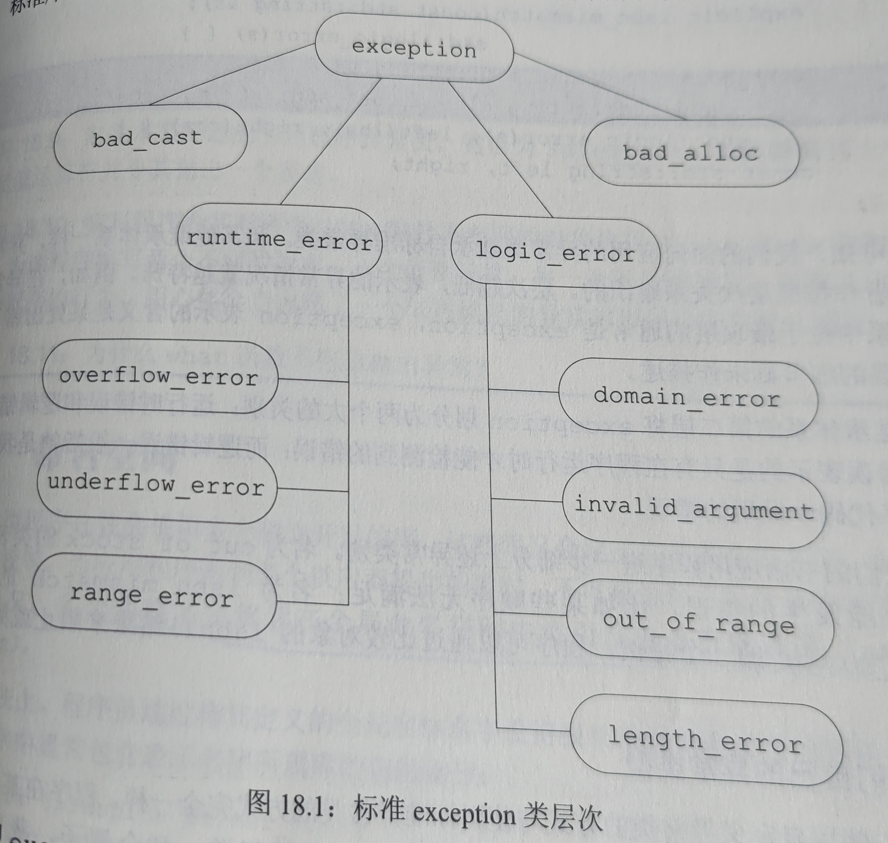

[TOC]
# 第十八章、用于大型程序的工具
## 18.1、异常处理
* 异常处理（exception handling）机制允许程序中独立开发的部分能够在运行时就出现的问题进行通信并作出相应的处理
### 18.1.1、抛出异常
* 栈展开
    * 当throw出现在一个try语句块时，检查该try语句块相关的catch字句，若有匹配则处理；若无匹配，则继续检查外层的try匹配的catch;
    * 栈展开过程沿着嵌套函数的调用链不断查找，知道找到与异常匹配的catch字句为止，没找到程序将调用标准库函数terminate，终止程序的执行过程;
    * 栈展开过程中对象自动销毁：
        * 块退出后，它的局部对象将被销毁
        * 若异常发生在构造函数中，即使某个对象只构造了一部分，也要确保已构造的成员正确地被销毁
        * 将资源释放放在类的析构函数中，以保证资源能被正确释放。析构函数本身不会引发异常
### 18.1.2、捕获异常

* 通常，若catch接受的异常与某个继承体系有关，则最好将该catch的参数定义成引用类型
* 搜索catch未必是最佳匹配，而是第一个匹配，因此，越细化的catch越应该放在catch列表前段; 如果多个catch语句的类型之间存在继承关系，应该将继承链最底端的类放在前面;
* 重新抛出：catch代码执行一条throw;将异常传递给另一个catch语句
* 捕获所有异常：catch(...),通常放在所有catch语句最后;

### 18.1.3、构造函数初始值异常
* 处理构造函数初始值异常的唯一方法是将构造函数写成函数try语句块
    ```cpp
    template <typename T>
    Blob<T>::Blob(std::initializer_list<T> il) try: 
        data(std::make_shared<std::vector<T> >(il){
            /*函数体*/
        } catch(const std::bad_alloc &e){ handle_out_of_memory(e); }
    ```

* 实例(18.1.1~18.1.3)
    ```cpp
    class Except0{
    public:
        Except0(int i)try: a(i) {}
        catch(const std::exception&) {}
        ~Except0() {cout << "Except0~" << endl;} 
    private:
        int a;
    };
    class Except1{
    public:
        ~Except1() {cout << "Except1~" << endl;} 
    };
    class Except2{
    public:
        ~Except2() {cout << "Except2~" << endl;} 
    };

    int main(){
        try{
            try{Except0 e(1); bad_alloc err; throw err;}
            catch(const bad_alloc &err) {
                Except1 e; cout << err.what() << endl;
                throw;  // 重新抛出异常 跳到外层catch  这一级catch结束
            }catch(const exception &err){
                Except2 e; cout << err.what() << endl;
            }catch(...) { cout << "unknown exceptions" << endl;}
        }catch(const bad_alloc &err){
            Except1 e; cout << "outlayer: " << err.what() << endl;
        }catch(const exception &err){
            Except2 e; cout << "outlayer: " << err.what() << endl;
        }catch(...) { cout << "outlayer: unknown exceptions" << endl;}
        return 0;
        /*
        Except0~
        std::bad_alloc
        Except1~
        outlayer: std::bad_alloc
        Except1~
        */
    }
    ```

### 18.1.4、noexcept异常说明
* 使用情况：
    * 确定函数不会抛出异常
    * 不知道如何处理异常，写了noexcept但是还是抛出异常，则程序会调用terminate终止程序;
* c++11中，noexcept说明符指定某个函数不会抛出异常;
    ```cpp
    void A(int) noexcept; //C++11
    void B(int) noexcept {throw exception();}
    ```
* noexcept运算符：是一个一元运算符，返回值是一个bool类型的右值常量表达式，表示给定的表达式是否会抛出异常;
    ```cpp
    noexcept(e);  // e不抛出异常则返回true,e抛出异常返回false
    ```
* noexcept说明符的实参常常和noexcept运算符混合使用;
    ```cpp
    // 表示f()和g()的异常说明一致，如果g()不抛出异常，则f()也不抛出异常
    void f() noexcept(noexcept(g()));  
    ```
* 如果一个基类虚函数承诺不会抛出异常，那么后续派生类的对应函数也必须承诺不会抛出异常；反之如果基类虚函数允许抛出异常，那么派生类的对应函数可以允许抛出异常也可以不允许抛出异常;

### 18.1.5、异常类层次
* 标准库异常类层次
    
    * bad_cast：cast转换错误
    * bad_alloc：分配内存错误
    * runtime_error: 运行时错误
    * logic_error：逻辑错误
* 自定义异常类型实例
    ```cpp
    class Sales_data {/*省略*/};
    class isbn_mismatch: public std::logic_error{
    public:
        // 直接调用logic_werror的构造函数logic_error
        explicit isbn_mismatch(const string &s): logic_error(s) {}
        isbn_mismatch(const string &s, const string &lhs, const string &rhs):
            logic_error(s), left(lhs), right(rhs) {}
        const string left, right;
    };
    Sales_data& Sales::operator+=(const Sales_data &rhs){
        if(isbn() != rhs.isbn())
            throw isbn_mismatch("isbn is mismatch", isbn(), rhs.isbn());
        // 正常相加操作
        return *this;
    }
    int main(){
        Sales_data item1, item2, sum;
        while(cin >> item1 >> item2){
            try{
                sum = item1 + item2;  // +内部调用+=
                // 如果isbn不匹配 无法相加 逻辑错误 抛出isbn_mistch异常
            }catch(const isbn_mismatch &e){
                cerr << e.what() << e.left << e.right << endl;
            }
        }
        return 0;
    }
    ```


## 18.2、命名空间
* 命名空间是为了防止多个库将名字放在全局命名空间中将引发命名空间污染，命名冲突。
### 18.2.1、命名空间定义
* 定义：namespace name
    * 命名空间中的成员可以包括：类、变量、函数、模板和其他命名空间;
    * 命名空间既可以定义在全局作用域内，也可以定义在其他命名空间内，但是不能定义在函数或类的内部;
    * 命名空间的名字name必须在作用域内保持唯一;
        ```cpp
            namespace cplusplus_primer{
                class Sales_data {};
                Sales_data operator+(const Sales_data&, const Sales_data&);
                class Query {};
                class Query_base {};
            }
        ```

    * 每一个命名空间都是作用域
        1. 命名空间中的名字必须在该命名空间中保持唯一，但不同的命名空间可以有相同名字的成员;
        2. 定义在某个命名空间中的名字可以被该命名空间内的其他成员和这些成员的内嵌作用域直接访问，但是该命名空间外的代码必须明确指出所使用的名字属于哪个命名空间;
            ```cpp
            cplusplus_primer::Query q = cplusplus_primer::Query("hello");
            ```
    * 命名空间可以是不连续的: 命名空间可以定义在几个不同的部分，因此命名空间的组织方式可以类似自定义类和函数，在头文件中对命名空间中类和接口函数进行声明，在源文件中对命名空间中类和接口函数进实现，用户中调用头文件使用命名空间中的类和接口函数; 
    * 注意：一般先include头文件，再打开命名空间定义;
        ```cpp
        // Sales_data.h
        #include <string>
        namespace cplusplus_primer {
            class Sales_data {};
            Sales_data operator+(const Sales_data&, const Sales_data&);
            // Sales_data类的其他接口声明
        }

        // Sales_data.cpp
        #include "Sales_data.h"
        namespace cplusplus_primer {
            // Sales_data类成员、重载函数及其他接口的定义
        }

        // user.cpp
        #include "Sales_data.h"
        int mian() {
            using cplusplus_primer::Sales_data;
            Sales_data sa1, sa2;
            // 使用Sales_data类的类成员、重载函数及其他接口
            return 0;
        }
        ```
* 命名空间类型
    * 全局命名空间：全局作用域中的名字隐式的添加在全局命名空间中;
        ```cpp
        int a = 2;  // 全局变量
        int main(){
            cout << ::a << endl;  
            return 0;
        }
        ```
    * 嵌套的命名空间：外层命名空间想使用内层命名空间中的名字必须在前面添加限定符;
        ```cpp
        namespace cplusplus_primer {
            // 第一个嵌套命名空间
            namespace QueryLib {
                class Query {};
                Query operator&(const Query&, const Query&);
            }
            // 第二个嵌套命名空间
            namespace BookStore {
                class Quote {};
                class Disc_quote: public Quote {};
            }
        } 
        cplusplus_primer::QueryLib::Query
        ```
    * 内联命名空间：内联命名空间中的名字可以被外层命名空间直接使用; 在命名空间第一次定义的地方前面加上inline，后续再打开可以加也可不加
        ```cpp
        namespace A{
            inline namespace B{
                class temp {};
            }
        }
        A::temp   // = A::B:temp
        ```
    * 未命名的命名空间：未命名的命名空间中定义的变量拥有静态声明周期，仅在特定的文件内部有效，其作用范围不会横跨多个不同的文件; 
        ```cpp
        int i;   // 全局作用域
        namespace{
            int i;  // 静态声明周期 此时和全局作用域相同
        }
        i = 10;  // 错 二义性
        ```
        嵌套的未命名空间
        ```cpp
        namespace local{
            namespace {
                int i;
            }
        }
        local::i = 42;
        ```
        c++中通常使用未命名的命名空间替代static全局声明
### 18.2.2、使用命名空间成员
* 原始方法：namespace_name::member_name，太繁琐
* 命名空间的别名
    ```cpp
    namespace cplusplus_primer {
        namespace QueryLib {
            class Query {};
        }
    }
    namespace primer = cplusplus_primer;
    primer::QueryLib::Query q;
    namespace CQ = cplusplus_primer::QueryLib;
    CQ::Query q;
    ```
* using声明: 一条using声明语句一次只引入命名空间的一个成员;
    ```cpp
    using std::string;
    string s;
    ```
* using指示：一条using指示语句一次引入该命名空间内的所有成员;
    ```cpp
    namespace A{
        int i = 16, j = 15, k = 32;   // A::j
    }
    int j = 0;  // ::j
    void temp(){
        // A和temp都在全局作用域内 将A中成员引入全局作用域
        using namespace A;  
        ++i;  // A::i=17
        ++j;  // 二义性 
        ++::j;  // ::j=1
        ++A::j;  // A::j=16
        int k = 97;  // 定义局部变量k 隐藏A::k 
        ++k;  // k=98
    }
    ```
* 头文件最多只能在它的函数或者命名空间内使用using指示或using声明，因为它会将名字注入到所有包含该头文件的文件中;

### 18.2.3、友元函数与命名空间
```cpp
namespace A{
    class C{
        // f1和f2隐式的成员命名空间A的成员
        friend void f1();
        friend void f2(const C&);
    };
}
A::C c;
f1();    // 错  没用参数 找不到f1函数  在A::C的友元声明中找到A::f
f2(c);   // 对  通过实参A::C c找到f2函数 
```

### 18.2.4、重载与命名空间
* 可以根据实参和作用域来推断调用哪个重载函数
    ```cpp
    namespace A{
        void print(int);
        void print(double);
    }
    void print(string);
    using namespace A;
    /*
    A::print(int)
    A::print(double)  但是这两个是全局的
    ::print(string)   也是全局的
    */
    print("hello");  // 调用::print(string)
    print(42);       // 调用A::print(int)
    print(3.14);     // 调用A::print(double)
    ```


## 18.3、多重继承与虚继承
### 18.3.1、多重继承
* 多重继承：派生类继承自多个基类，且继承了所有基类的属性;
    ```cpp
    class ZooAnimal {};
    class Endangered {};
    class Bear: public ZooAnimal {};
    class Panda: public Bear, public Endangered {};  // 多重继承
    ```
* 多重继承和构造/析构函数
    * 派生类的构造函数必须初始化所有直接基类的属性，且构造函数初始化顺序和派生类中基类的出现顺序一致;
        ```cpp
        Panda::Panda(string name, bool onExhibit):
            Bear(name, onExhibit, "Panda"),
            Endangered(Endangered::critical) {}
        ```
    * 创建一个Panda对象的构造函数调用顺序：ZooAnimal -> Bear -> Endangered -> Panda;
    * 销毁一个Panda对象的析构函数调用顺序：Panda -> Endangered -> Bear -> ZooAnimal;
    * 运行派生类从它的一个或多个基类中继承构造函数，但是如果从多个基类中继承了相同的构造函数（形参相同）,则程序将产生错误;
        ```cpp
        struct Base1 {
            Base1() = default;
            Base1(const string&);
        };
        struct Base2 {
            Base2() = default;
            Base2(const string&);
        };
        struct D1: public Base1, public Base2 {
            using Base1::Base1;  // data1
            using Base2::Base2;  // data2
        };
        struct D2: public Base1, public Base2 {
            using Base1::Base1;
            using Base2::Base2;
            D2(const string &s): Base1(s), Base2(s) {}
            D2() = default;
        };
        D1 d11;        // 对 调用
        D1 d12("hi");  // 错 
        D2 d21;        // 对
        D2 d22("hi");  // 对
        ```
* 多重继承和类型转换
    * 在只有一个基类时，派生类的指针或引用能自动转换为一个可以访问基类的指针或引用; 在有多个基类时，可以令某个可访问基类的指针或引用直接指向一个派生类对象;
        ```cpp
        class ZooAnimal {};
        class Endangered {};
        class Bear: public ZooAnimal {};
        class Panda: public Bear, public Endangered {};  // 多重继承
        void A(const Bear&);
        void B(const Endangered&);
        void C(const ZooAnimal&);

        Panda pd;
        A(pd);  // 把一个Panda对象传递给一个Bear的引用 
        B(pd);  // 把一个Panda对象传递给一个Endangered的引用  
        C(pd);  // 把一个Panda对象传递给一个ZooAnimal的引用 
        ```
    * 编译器不会在派生类向基类的几种转换中进行比较和选择，因为在它看来转换到任意一种基类都一样好;
        ```cpp
        void A(const Bear&);
        void A(const Endangered&);
        Panda pd;
        print(pd);  // 错误 二义性  不知道转换为Bear还是Endangered
        ```
* 多重继承和类作用域
    * 当一个类拥有多个基类时，有可能出现派生类从两个或更多基类中继承了同名成员的情况，直接使用这个同名成员会造成二义性
        ```cpp
        // 假设ZooAnimal和Endangered有同名成员max_weight()
        Panda pd;
        pd.max_weight();  // 错误 二义性
        ```
    * 避免二义性的最好办法是在派生类中也定义一个新版本同名成员

### 18.3.2、虚继承
* 虚继承
    * 目的：解决多重继承时可能发生的对同一基类继承多次而产生的二义性问题，为最远的派生类提供唯一的基类成员，而不重复产生多次复制;
    * 做法：对某个类作出声明，承诺它愿意共享它的基类,共享的基类称为虚基类
    * 示例
        ```cpp
        class ZooAnimal {};
        class Bear: virtual public ZooAnimal {};  // 
        class Raccoon: public virtual ZooAnimal {};
        class Panda: public Bear, public Raccoon, public Endangered {};
        void A(const Bear&);
        void B(const Raccoon&);
        void C(const ZooAnimal&);
        Panda pd;
        A(pd);  // 把Panda对象转换为Bear对象
        B(pd);  // 把Panda对象转换为Raccoon对象
        C(pd);  // 把Panda对象转换为ZooAnimal对象
        ```
    * 虚基类成员的可见性
        * 示例：B定义一个x成员，D1和D2从B中虚继承得到，D继承D1和D2
        * 如果D1和D2中没有定义x成员，那么D中的x被解析为B的x;
        * 如果D1和D2只有一个定义了x成员，那么D中的x被解析为D1或D2的x;
        * 如果D1和D2都定义了x成员，那么会产生二义性，最好在D中也定义x成员防止二义性发生;

* 虚继承和构造/析构函数
    * 在虚派生中，为防止重复初始化，虚基类的构造函数是由最底层的派生类初始化的;
        ```cpp
        // 定义Bear的构造函数时，此时Bear就是最底层的派生类 需要初始化虚基类 同理Raccoon也是
        Bear::Bear(string name, bool onExhibit): ZooAnimal(name, onExhibit, "Bear") {}
        Raccoon::Raccoon(string name, bool onExhibit): ZooAnimal(name, onExhibit, "Raccoon") {}
        Panda::Panda(string name, bool onExhibit): ZooAnimal(name, onExhibit, "Bear"),
                Bear(name, onExhibit), Raccoon(name, onExhibit), 
                Endangered(Endangered::critical), sleeping_flag(false) {}
        ```
    * 含有虚基类的派生类的构造函数初始化顺序和普通的派生类构造函数初始化顺序不同：必须先初始化虚基类部分、再按派生列表中直接基类出现顺序初始化、最后初始化派生类自己的部分
        ```cpp
        Panda pd("panda", true);
        // 初始化调用顺序：ZooAnimal部分->Bear部分->Raccoon部分-> Endangered部分->panda部分
        ```
    * 销毁pd时调用析构函数的顺序和构造函数初始化顺序刚好相反;