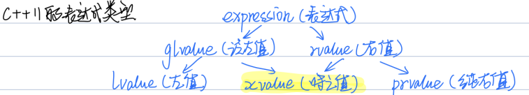

[TOC]
# 基础2、值类型与右值引用
1. 是否真的清楚下面的函数执行几次拷贝？
    ```cpp
    int geta(){
        int a = 10;
        return a;
    }
    int x = geta();
    // <=> 
    int temp = a;
    int x = temp;
    ```
    c++底层：这里会执行两次拷贝，geta()函数return返回的其实是另外一个临时变量temp, 也就是说函数内会执行两个拷贝，生成两个临时变量，最后执行两次析构函数，这是非常低效的。
    
    ```cpp
    // 测试
    class BigMemoryPool
    {
    public:
        static const int PoolSize = 4096;
        BigMemoryPool() : pool_(new char[PoolSize]) {std::cout << "默认构造函数" << std::endl;}
        ~BigMemoryPool()
        {
            if (pool_ != nullptr)
            {
                std::cout << "析构函数" << std::endl;
                delete[] pool_;
            }
        }
        BigMemoryPool(BigMemoryPool &&other) noexcept
        {
            std::cout << "移动构造" << std::endl;
            pool_ = other.pool_;
            other.pool_ = nullptr;
        }
        BigMemoryPool(const BigMemoryPool &other) : pool_(new char[PoolSize])
        {
            std::cout << "拷贝构造" << std::endl;
            memcpy(pool_, other.pool_, PoolSize);
        }
    
    private:
        char *pool_;
    };
    
    int main(){
        BigMemoryPool bbb = getPool();  // 正常编译执行，输出1次默认构造函数+1次析构函数 因为c++底层又作了返回值优化
        // 但是如果执行g++  .\others\main.cpp -o .\others\main  -fno-elide-constructors 关闭返回值优化
        // 输出：默认构造函数 + 拷贝构造 + 析构函数 + 拷贝构造 + 析构函数 + 析构函数
        return 0;
    }
    ```

2. c++98的表达式类型
    * 左值右值其实是一个表达式: int a = 10; 这里的a是左值，也是一个表达式;
    * 左值：指向特定内存的具名对象(表达式结束时还存在的持久对象)，可以取地址，如：int a = 10，&a;
    * 右值：无法取地址的对象(表达式结束时就不再存在的临时对象)：字符串除外的字面量、临时对象（函数内变量、返回返回值、2*i）;
        ```cpp
        int gx = 10;
        int &r = gx * 2;  // 错  gx*2是右值 是一个临时变量
        int get_gx()
        {
            return gx;
        }
        
        int get_x()
        {
            int x = 20;
            return x;
        }
        int a = &get_x();   // 错  函数返回值是临时变量
        int b = &get_gx();  // 错 虽然gx是全局变量  但是函数返回值还是临时变量 
        
        int x = 10;
        int *p1 = &x++;  // 错
        int *p2 = &++x;  // 对

        int fun1(int &a){  // x++
            int b = a;
            a = a + 1;
            return b;  // 返回的是一个临时变量 所以是右值
        }
        int& fun2(int &a){  // ++x
            a = a + 1;
            return a;  // 返回的是一个引用 即一个变量的别名 所以是左值
        }
        ```
    * 特别注意，字符串字面量是一个左值
        ```cpp
        // 用寄存器存一个值10 再把10赋给a 不会存在内存中 不能取地址 所以10是一个右值   
        int a = 10;   
        // 但是如果字符也用寄存器保存 不太现实 如果这个字符很大 效率就很低  
        // 所以编译器会将"hello world"常量放入内存中 再赋给str[12] 所以字符串可以取地址 是一个左值
        // 另外这里str[12]是因为字符串后面还有一个/0结束字符
        // "hello world" 类型是const char[12] 顶层const可以忽略
        char str[12] = "hello world"; 
        // const char[12]退化为一个指针const char* （base3第二点）
        // 这里的const不能省略, 底层const
        const char *p = "hello world"; 
        ```


3. c++11的表达式类型
    


4. 右值引用和移动语义
    * 右值引用也是一个引用，不过是对某个对象取了另外一个名字而以；
    * 左值引用，&a, 右值引用，&&a;
    * 左值引用不能接受右值（const左值引用除外），右值引用只能接受右值;
        ```cpp
        int x = 10; 
        int y = 20;
        int &a = 10;    // 错  左值引用不能接受右值
        const int &r = i * 42;  // 正确  const的左值引用可以接受右值
        int &&b = 10;   // 对 
        int &&c = y;    // 错  右值引用无法接受左值
        ```
    * 移动语义：std::move，可以将左值变成即将消亡的值->右值; ==移动语义没移动==，移动语义只是将左值转换为了将亡值，真正的移动操作是移动构造函数操作的;

5. 赋值操作真的只有拷贝这一个途径嘛？
    * 拷贝操作：将一个已存在的对象的所有数据完全拷贝给另一个对象，太慢;
        ```cpp
        BigMemoryPool aaa;
        BigMemoryPool bbb = aaa;  // 拷贝构造函数
        bbb = aaa;                // 拷贝赋值运算符
        ```
    * 引用操作：两个对象共享同一份数据，但是改变aaa对象也会改变ccc对象，限制很大;
        ```cpp
        BigMemoryPool &ccc = aaa;  // 引用
        ```
    * 移动操作：不会分配新的内存资源，会从源对象窃取内存资源；
        * 完整做法：将一个左值对象通过移动语义变成将亡值->右值对象a，再将这个右值对象a传入移动构造函数，将移动构造函数中的this对象的指针全部指向a对象的地址区域，再将a对象所有指针置空，完成移动操作;
        * 需要注意：源对象必须是一个将亡的，即销毁源对象是无害的，可析构的状态。而且一旦移动操作完成，源对象将不能再指向被移动的资源，这些资源属于新对象;
        * 通常需要将移动构造函数和移动赋值运算符设置为noexcept, 告诉编译器可以放心操作;


6. 如何得到将亡值
    * 将泛左值转换为将亡值：1、static_cast强制类型转换:static_cast< type &&>(xxx); 2、std::move(xxx);
    * 临时量实质化: c++17引入新特性;


7. 其他需要注意的点
    * ==纯右值也可以std::move==:相当于把int类型转换为int类型，明显可以;
    * ==类中未实现移动构造，std::move之后仍然执行拷贝构造==:std::move只是将左值转换为将亡值(右值)，但是之后执行构造函数因为没有移动构造函数所以还是调用的拷贝构造;
    * ==右值引用仍是左值==：右值引用还是引用，本质上只是一个别名，还是可以对它取地址;
    * ==右值绑定到右值引用上，移动构造和拷贝构造都不会发生==;
        ```cpp
        BigMemoryPool aaa;   // 默认构造函数
        BigMemoryPool bbb = aaa;  // 拷贝构造函数
        BigMemoryPool ccc = std::move(aaa);  // 移动构造函数
        BigMemoryPool &ddd = aaa;  // 什么都不发生  只是起了一个别名
        BigMemoryPool &&eee = std::move(aaa);  // 什么都不发生 只是起了一个别名
        ```

8. 题目理解
    ```cpp
    // 参数是引用类型 所以什么也不执行
    BigMemoryPool get_pool(const BigMemoryPool &pool)  
    {
        // 隐式：BigMemoryPool temp1 = pool;  2、拷贝构造
        // return temp1;   
        return pool;
    }
    BigMemoryPool make_pool()
    {
        BigMemoryPool pool;  // 1、默认构造
        // 隐式：BigMemoryPool temp2 = temp1;  3、移动构造
        // return temp2
        return get_pool(pool);
    }
    // BigMemoryPool ccc = temp2;  4、移动构造
    BigMemoryPool ccc = make_pool();
    
    // 输出1次默认构造+1次拷贝构造+2次移动构造+2次析构
    ```


