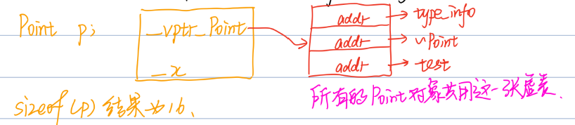
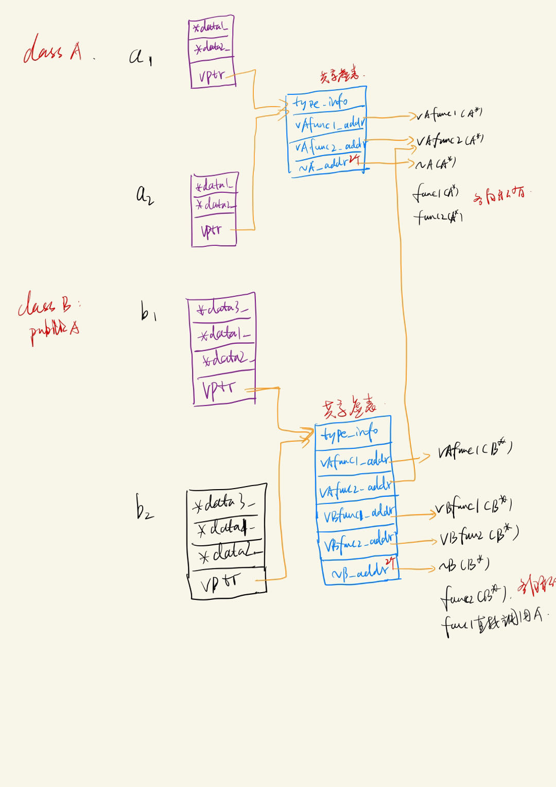

[TOC]
# 基础4、c++类对象布局
重点知识：对象模型、字节对齐、虚表

* 背景知识
    * 常见的类型字节数
        * bool: 1字节
        * char: 1字节
        * short: 2字节
        * int: 4字节
        * long: win64 4字节，linux64 8字节
        * long long: 8字节
        * float: 4字节
        * double: 8字节
        * point: 8字节


* 一个类通常包括数据成员（静态和非静态），函数（虚函数和非虚函数）;
    ```cpp
    class Point {
        // 非虚函数  存在代码区
        Point(float xval);
        float x() const;
        static int PointCount();
        // 虚函数   存在代码区 但是每个对象会维护一个虚表指针 这些虚表指针vfptr都指向同一张虚表
        virtual ~Point();
        virtual void test();
        
        // 非静态数据成员
        float _x;
        // 静态数据成员
        static int _count;
    };
    ```
* 对象模型
    每个类对象存放一个非静态数据成员_x和一个指向虚表的指针vfptr，这些指针会指向同一张虚表（所有对象公用同一张虚表），虚表中存放两个虚函数和一个type_info；
    


* 影响c++对象大小的三个因素：非静态数据成员、虚函数、字节对齐；


* 字节对齐
    * 问题提出：上图sizeof(p)=16字节，但是_x=4字节，point=8字节，相加等于12个字节，为什么？原因就在于字节对齐;
    * 内存对齐好处：提高内存访问的效率和性能（操作系统底层编译有关）；
    * 内存对齐的规则
        * 类中变量占用n个字节，那么这个变量应该放在n的整数倍上；
        * 结构体最后会向内部最大对象对齐；
        * 因为内存对齐的存在，类内属性的声明顺序就要注意；
            ```cpp
            struct t1 { 
                int a;     // 4        0~3
                short b;   // 2 + 2    本来是4-5  但是需要内存对齐  4-7
                int c;     // 4        6不是4的整数倍 所以从8开始  8-11  
                short d;   // 2 + 2    12-13 但是结构体最后要和4对齐 所以12-15
            };

            struct t2 {
                int a;    // 4   0~3
                int c;    // 4   4~7
                short b;  // 2   8~9   
                short d;  // 2   10~11  10是2的倍数 所以b不需要对齐  最后12是4的倍数 所以d不需要对齐
            };
            ```
    * 继承中的内存对齐: 先计算基类的内存对齐，再计算派生类的内存对齐，两者独立计算;
        ```cpp
        struct A {
            int a;    // 4
            short b;  // 2 + 2
        };
        struct B: public A {   
            short c;  // 2 + 2
        };
        // sizeof(B) = 12  因为sizeof(A)=8最后两个字节补0,  如果sizeof(B)=8最后两个字节是c, 那么B强行转换为A时就会出问题
        ```

* 继承过程中的类对象布局
    * 实例
        ```cpp
        class A {
        public:
            A() {
                data1_ = new int();
                data2_ = new int();
            }
            virtual void vAfunc1() { std::cout << "A::vAfunc1()" << std::endl; }
            virtual void vAfunc2() { std::cout << "A::vAfunc2()" << std::endl; }

            void func1() { std::cout << "A::func1()" << std::endl; }
            void func2() { std::cout << "A::func2()" << std::endl; }

            virtual ~A() {
                std::cout << "A::~A" << std::endl;
                delete data1_;
                delete data2_;
            }
        private:
            int *data1_;
            int *data2_;
        };

        class B: public A{
        public:
            B() {
                // 执行子类的构造/析构函数之前会先自动执行基类的构造/析构函数
                data3_ = new int; 
            }
            virtual void vAfunc1() override { std::cout << "B::vAfunc1" << std::endl; }
            virtual void vBfunc1() { std::cout << "B::vBfunc1" << std::endl; }
            virtual void vBfunc2() { std::cout << "B::vBfunc2" << std::endl; }

            void func2() { std::cout << "B::func2" << std::endl; }
            
            virtual ~B() {
                std::cout << "B::~B" << std::endl;
                delete data3_;
            }
        private:
            int *data3_;
        };
        ```
    * 内存布局图
        
    * 验证
        ```cpp
            A a;
            B b;
            a.vAfunc1();
            a.vAfunc2();
            a.func1();
            a.func2();
            b.vAfunc1();  // B::vAfunc1()
            b.vAfunc2();  // A::vAfunc2()
            b.vBfunc1();  // B::vBfunc1()
            b.vBfunc2();  // B::vBfunc2()
            b.func1();    // A::func1()
            b.func2();    // B::func2()
            // B::~B()
            // A::~A()
            // A::~A()
        ```
