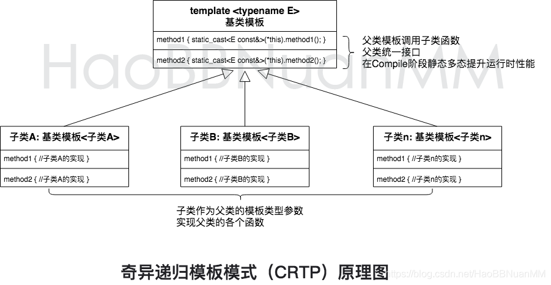
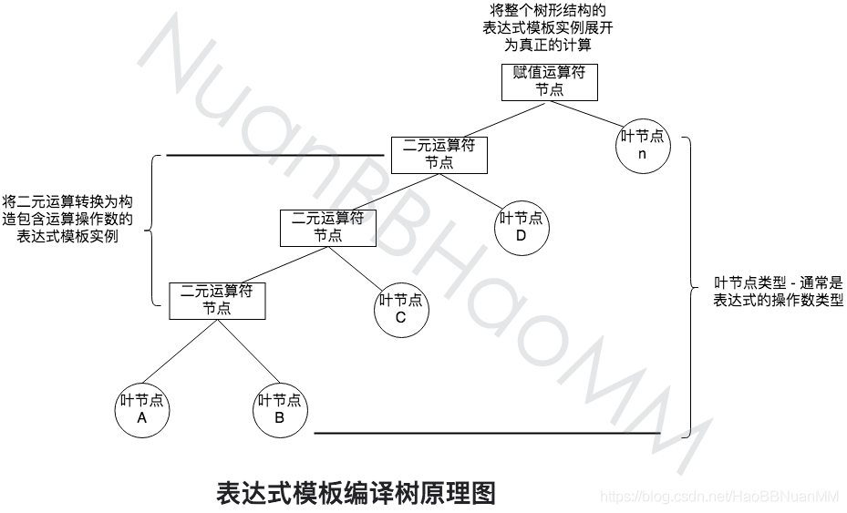
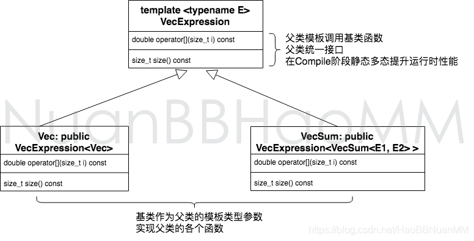
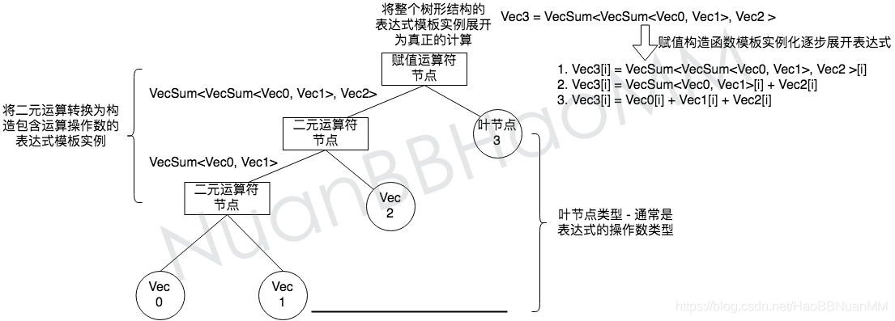

[TOC]
# 基础9、CRTP与Expression Templates
https://blog.csdn.net/HaoBBNuanMM/article/details/109740504

## 9.1、奇异递归模板模式（CRTP）
* 定义：它通过在派生类中继承一个模板基类，并将派生类自身作为模板参数传递给基类，从而实现在==编译时==进行静态绑定的效果
* 实例
    ```cpp
    template <typename Derived>
    class Base {
    public:
        //  Base是一个模板基类，它接受一个派生类类型作为模板参数   doSomething()函数
        //  通过静态转换将this指针转换为派生类类型，并调用派生类中的impl()函数 
        void doSomething() {
            static_cast<Derived*>(this)->impl();
        }
    };

    class Derived: public Base<Derived> {
    public:
        // Derived是派生类，它继承自Base<Derived> 并实现了impl()函数
        void impl() { std::cout << "D1::impl" << std::endl; }
    };

    // 由于Derived类继承自Base<Derived> 因此在调用doSomething()时，会根据静态绑定的规则调用Derived类中的impl()函数
    Base<Derived> b;
    b.doSomething();  // D1::impl
    ```
    

## 9.2、表达式模板（Expression Template）
* 定义：是CRTP的应用，基本思想是将表达式的各个操作数封装成模板类的对象，将表达式中的所有操作数全部保存在模型类的对象中，先不进行计算，并通过重载运算符来定义表达式的求值方式，当需要使用哪个元素的时候，只计算相关的元素即可，不需要全部计算出来
    ```cpp
    v1 = {1, 1, 1};
    v2 = {2, 2, 2};
    v3 = {3, 3, 3};
    v4 = v1 + v2 + v3;
    先将v1+v2->tmp保存在一个类对象中，再将tmp+v3保存在一个类对象中，当执行v4[1]时再递归计算v1[1]+v2[1]+v3[1]即可，不需要计算无关元素
    ```
    表达式模板编译树原理图：
    
* 作用
    * 节省表达式中间结果的临时存储空间，减少计算的循环次数
    * 延迟计算表达式，从而可以将表达式传递给函数参数，而不是只能传递计算结果
* 实例
    ```cpp
    // https://blog.csdn.net/HaoBBNuanMM/article/details/109740504
    // CRTP中的基类模板
    template <typename E>
    class VecExpression
    {
    public:
        // 通过将自己static_cast成为子类，调用子类的对应函数实现实现静态多态
        double operator[](size_t i) const { return static_cast<E const &>(*this)[i]; }
        size_t size() const { return static_cast<E const &>(*this).size(); }
    };

    // 将自己作为基类模板参数的子类 - 对应表达式编译树中的叶节点
    class Vec : public VecExpression<Vec>
    {
        std::vector<double> elems;

    public:
        double operator[](size_t i) const { return elems[i]; }
        double &operator[](size_t i) { return elems[i]; }
        size_t size() const { return elems.size(); }

        Vec(size_t n) : elems(n) {}

        Vec(std::initializer_list<double> init)
        {
            for (auto i : init)
                elems.push_back(i);
        }

        // 赋值构造函数可以接受任意父类VecExpression的实例，并且进行表达式的展开
        // （对应表达式编译树中的赋值运算符节点）
        template <typename E>
        Vec(VecExpression<E> const &vec) : elems(vec.size())
        {
            for (size_t i = 0; i != vec.size(); ++i)
            {
                elems[i] = vec[i];
            }
        }
    };

    // 将自己作为基类模板参数的子类 - 对应表达式编译树中的二元运算符输出的内部节点
    // 该结构的巧妙之处在于模板参数E1 E2可以是VecSum，从而形成VecSum<VecSum<VecSum ... > > >的嵌套结构，体现了表达式模板的精髓：将表达式计算改造成为了构造嵌套结构
    template <typename E1, typename E2>
    class VecSum : public VecExpression<VecSum<E1, E2>>
    {
        E1 const &_u;
        E2 const &_v;

    public:
        VecSum(E1 const &u, E2 const &v) : _u(u), _v(v)
        {
            assert(u.size() == v.size());
        }

        double operator[](size_t i) const { return _u[i] + _v[i]; }
        size_t size() const { return _v.size(); }
    };

    // 对应编译树上的二元运算符，将加法表达式构造为VecSum<VecSum... > >的嵌套结构
    template <typename E1, typename E2>
    VecSum<E1, E2> const operator+(E1 const &u, E2 const &v)
    {
        return VecSum<E1, E2>(u, v);
    }


    int main(){
        // 创建3个叶子节点
        Vec v0 = {1.0, 1.0, 1.0}; // 1000
        Vec v1 = {2.0, 2.0, 2.0}; // 1000
        Vec v2 = {3.0, 3.0, 3.0}; // 1000
        auto v4 = v0 + v1;   // auto才能延迟计算
        auto v5 = v4 + v2; 
        auto v8 = v0 + v1 + v2; // 20
        // 构建表达式 v0 + v1 + v2，赋值给v3，编译阶段形成表达式树
        Vec v3 = v0 + v1 + v2;  // 直接计算 不是延迟计算

        // v_result = v0 + ... + v19
        float aa = v5[1];
        return 0;
    }
    ```
    实例中的CRTP继承关系：
      
    实例中的表达式编译树： 
   
