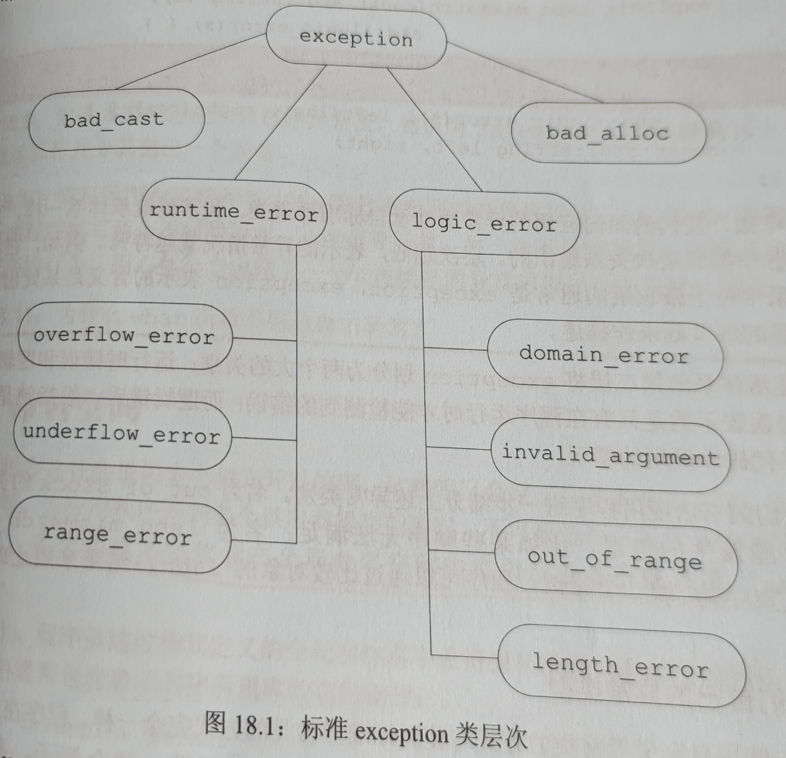
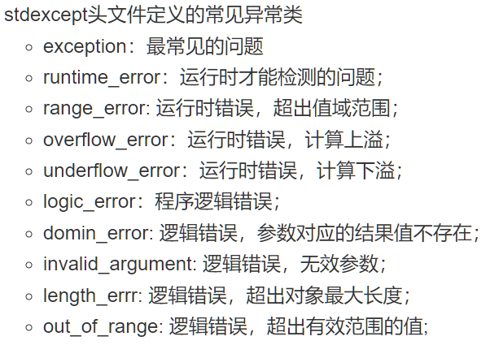
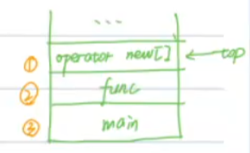

[TOC]
# 基础11、c++中的异常处理及swap&copy


## 11.1、异常处理
* 异常处理的手段
    * 抛出异常：throw 异常；
        * 作用是让调用者看到异常
    * 接住异常：try{可能会抛出异常的code} catch(异常类型) {处理方式}
        * 如果不清楚异常类型，可以使用catch(...){}，可以接任何类型的异常，必须写在最后
        * catch中还可以使用throw继续抛出异常
        * 父类异常引用可以接子类异常
        * catch，一般先写子类，再写父类，最后写...，因为有些是可以完美匹配的
        ```cpp
        void strcpy(char *p, const char *q) {
            if (!p || !q) {
                throw std::invalid_argument("Null pointer");
            }
            while(*q != '\0') {
                *p++ = *q++;
            }
            *p = '\0';
        }

        char p1[20];
        char *p2 = nullptr;
        const char *q = "hello";
        try {
            strcpy(p1, q);
            strcpy(p2, q);   // 异常
        }catch(const std::logic_error &e) {   // 父类异常引用可以接子类异常
            std::cout << e.what() << std::endl;
        }catch(...) {}  // 可以接任意类型异常
        ```

* 标准库的异常类
    * 标准库异常类层次
        
        


* 栈展开
    * 作用: 销毁局部变量
    * 实例
        ```cpp
        void func(int n) {
            int x = 42;
            int *p = new int[n];
        }

        int main(){
            int size = 100000;
            try {
                func(size);
            } catch(...) {}
            return 0;
        }
        ```
    * 内存中这段代码的存储方式：栈
        
    * 栈展开流程
        * 在p进行初始化new时抛出异常，开始进行栈展开流程，不过此时p还没被创建，所以不需要对p进行销毁
        * 但是此时x已经创建了，x需要被销毁，n也同样被销毁，返回main函数
        * 此时有try和catch处理这个异常，栈展开结束，此时size是不会被销毁的
    * 注意：栈展开只有在try和catch处理的时候才能发生


* 构造函数的try和catch
    * 处理构造函数初始值异常的唯一方法是将构造函数的初始化列表写成函数try语句块，只要初始化列表中发生异常就会被catch捕获到
    * 实例  
        ```cpp
        class Array {
        public:
            // m_size(n), m_data(new int[n]) 这一部分只要抛出异常都会被catch到
            Array(size_t n) try: m_size(n), m_data(new int[n]) {

            }catch (const std::bad_alloc &e){
                std::cout << "No enough memory" << std::endl;
                std::cout << e.what() << std::endl;
            } 
        private:
            size_t m_size;
            int *m_data;
        };
        ```
* 异常安全保证
    * 不抛出保证：保证一定不抛出异常，noexcept可以做到，并且可以让编译器进行更好的优化
    * 强异常安全保证：抛出异常，==所有变量状态不变==
    * 弱异常安全保证：抛出异常，==某些变量状态发生改变==，但都是有效状态
    * 无异常安全保证：函数可能会有问题


## 11.2、swap&copy
* 作用：涉及手动申请内存的类（new delete），在进行拷贝赋值的时候，非常容易因为代码的顺序而破坏异常安全性，而swap&copy操作则巧妙的解决了这个问题
  
* 实例
    * 不够安全的代码
        ```cpp
        class Buffer{
        private:
            unsigned char *_buf;
            int _capacity;
            int _lenght;
        public:
            // 构造函数  可能会抛出异常：new  
            // 强异常安全保证：new抛出异常时，this这个Buffer根本没有成功创建出来，状态不变
            explicit Buffer(int capacity): _capacity(capacity), _lenght(0) {  
                _buf = capacity == 0 ? nullptr : new unsigned char[capacity]{};
                std::cout << "Buffer(int capacity)" << std::endl;
            }
            // 析构函数：不会抛出异常  
            // 不抛出保证  肯定不会发生异常
            ~Buffer() noexcept{
                delete[] _buf;
                std::cout << "~Buffer()" << std::endl;
            }
            // 拷贝构造函数  可能会抛出异常：new  
            // 强异常安全保证：new抛出异常时，this这个Buffer根本没有成功创建出来，状态不变
            Buffer(const Buffer &buffer) {
                _capacity = buffer._capacity;
                _lenght = buffer._lenght;
                _buf = new unsigned char[buffer._capacity]{};
                std::copy(buffer._buf, buffer._buf + buffer._capacity, _buf);
                std::cout << "Buffer(const Buffer &buffer)" << std::endl;
            }
            // 移动构造函数  
            // 不抛出保证  都是赋值操作 肯定不会发生异常
            Buffer(Buffer &&buffer) noexcept{
                _capacity = buffer._capacity;
                _lenght = buffer._lenght;
                _buf = buffer._buf;
                buffer._buf = nullptr;
                buffer._capacity = 0;
                buffer._lenght = 0;
                std::cout << "Buffer(Buffer &&buffer)" << std::endl;
            }
            // 拷贝赋值运算符  可能会抛出异常：new
            // 弱异常安全保证：new抛出异常时this这个Buffer已经存在了，所以_capacity、_lenght和_buf状态都已经发生了改变
            Buffer& operator=(const Buffer &buffer) {
                if(this != &buffer) {
                    _capacity = buffer._capacity;
                    _lenght = buffer._lenght;
                    delete[] _buf;
                    _buf = new unsigned char[buffer._capacity];
                    std::copy(buffer._buf, buffer._buf + buffer._capacity, _buf);
                }
                std::cout << "Buffer& operator=(const Buffer &buffer)" << std::endl;
                return *this;
            }
            // 移动赋值运算符
            // 不抛出保证：都是赋值操作 肯定不会发生异常
            Buffer& operator=(Buffer &&buffer) noexcept {
                if(this != &buffer) {
                    _capacity = buffer._capacity;
                    _lenght = buffer._lenght;
                    delete[] _buf;
                    _buf = buffer._buf;
                    buffer._buf = nullptr;
                    buffer._capacity = 0;
                    buffer._lenght = 0;
                }
                std::cout << "Buffer& operator=(Buffer &&buffer)" << std::endl;
                return *this;
            }
            
            bool write(unsigned char v) noexcept{
                if(_lenght == _capacity)
                    return false;
                _buf[_lenght++] = v;
                return true;
            }
        };
        ```

    * swap&copy改进版
        ```cpp
        class Buffer{
        private:
            unsigned char *_buf;
            int _capacity;
            int _lenght;
        public:
            // 构造函数  可能会抛出异常：new  
            // 强异常安全保证：new抛出异常时，this这个Buffer根本没有成功创建出来，状态不变
            explicit Buffer(int capacity): _capacity(capacity), _lenght(0), 
                _buf(capacity == 0 ? nullptr : new unsigned char[capacity]) {  
                std::cout << "Buffer(int capacity)" << std::endl;
            }
            // 析构函数：不会抛出异常  不抛出保证
            ~Buffer() noexcept{
                delete[] _buf;
                std::cout << "~Buffer()" << std::endl;
            }
            // 拷贝构造函数  可能会抛出异常：new  
            // 强异常安全保证：new抛出异常时，this这个Buffer根本没有成功创建出来，状态不变
            Buffer(const Buffer &buffer): _capacity(buffer._capacity), _lenght(buffer._lenght), 
                _buf(new unsigned char[buffer._capacity]) {
                std::copy(buffer._buf, buffer._buf + buffer._capacity, _buf);
                std::cout << "Buffer(const Buffer &buffer)" << std::endl;
            }
            // 移动构造函数  
            // 不抛出保证  都是赋值操作  异常安全保证  肯定不会发生异常
            Buffer(Buffer &&buffer) noexcept : Buffer(0){
                // _capacity = buffer._capacity;
                // _lenght = buffer._lenght;
                // _buf = buffer._buf;
                // buffer._buf = nullptr;
                // buffer._capacity = 0;
                // buffer._lenght = 0;
                swap(buffer, *this);
                std::cout << "Buffer(Buffer &&buffer)" << std::endl;
            }
            // 拷贝/移动赋值运算符  强异常安全保证
            // Buffer buffer2 = buffer1;
            Buffer& operator=(Buffer buffer) {   // 这里可能会抛出异常
                // 当传入一个左值 这里不是一个& 所以会发生一次拷贝构造 执行new和copy操作 即临时变量buffer = buffer1
                // 当传入一个右值 这里会发生一次移动构造 
                // if(this != &buffer) {
                //     _capacity = buffer._capacity;
                //     _lenght = buffer._lenght;
                //     delete[] _buf;
                //     _buf = new unsigned char[buffer._capacity];
                //     std::copy(buffer._buf, buffer._buf + buffer._capacity, _buf);
                // }
                swap(buffer, *this);   // buffer2=*this=buffer1
                std::cout << "Buffer& operator=(const Buffer &buffer)" << std::endl;
                return *this;
                // 删除临时变量buffer
            }
            // 移动赋值运算符
            // 不抛出保证：都是赋值操作 肯定不会发生异常
            // Buffer& operator=(Buffer &&buffer) noexcept {
            //     if(this != &buffer) {
            //         _capacity = buffer._capacity;
            //         _lenght = buffer._lenght;
            //         delete[] _buf;
            //         _buf = buffer._buf;
            //         buffer._buf = nullptr;
            //         buffer._capacity = 0;
            //         buffer._lenght = 0;
            //     }
            //     std::cout << "Buffer& operator=(Buffer &&buffer)" << std::endl;
            //     return *this;
            // }
            
            bool write(unsigned char v) noexcept{
                if(_lenght == _capacity)
                    return false;
                _buf[_lenght++] = v;
                return true;
            }
            friend void swap(Buffer &lhs, Buffer &rhs);
        };

        void swap(Buffer &lhs, Buffer &rhs) {
            using std::swap;
            swap(lhs._buf, rhs._buf);
            swap(lhs._capacity, rhs._capacity);
            swap(lhs._lenght, rhs._lenght);
        }
        ``` 
