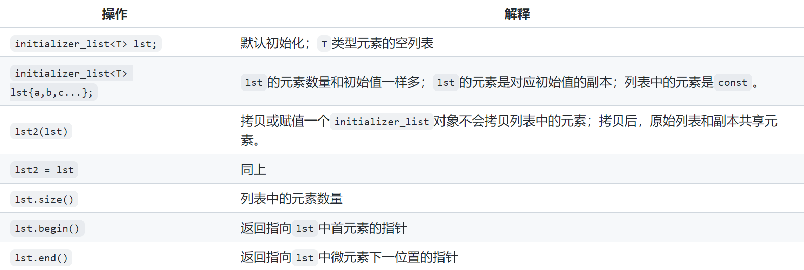

[TOC]
# 条款7、在创建对象时注意区分()和{}
基础: base2
==尽可能的使用{}==

## 7.1、前提知识
1.  聚合类的定义与不同标准的区别
    * c++11: 1、所有成员都是public；2、没有定义任何构造函数，但是可以写成默认构造函数=default；3、没有类内初始化；4、没有基类，也没有虚函数；
    * c++11存在的问题：初始化任务交给了用户；
    * c++17修改：可以有类内初始化，也可以有基类，但是必须是public继承，且必须不是非虚继承（基类可以不是聚合类）；
        ```cpp
        class B{  // B不是聚合类
            string s;
        };

        class A: public B{   // 可以有基类 但是必须是public继承
        public:   // 成员都是public  没有构造函数
            int idx = 0;  // 可以类内初始化
        };

        A a{"hello world", 1};
        A a{{"hello world"}, 1 };
        ```
2. 最令人头疼的解析问题和{}解决方案
    * 示例1
        ```cpp
        // 第一种解析方式：创建了一个int变量(double value -> int -> i)
        // 第二种解析方式：声明了一个函数int i(int value); 因为c语言运行参数被多余的括号包裹，会自动删除多余的括号，而c++继承自c语言
        // 实际解析方式是第二种
        void f(double value){
            int i(int(value));
        }

        // 列表初始化{}可以解决这个问题  解析成第一种解析
        void f2(double value){
            int i{int(value)};
        }
        ```
    * 示例2
        ```cpp
        struct A{};
        struct B{ B(A a) {} };

        // 第一种解析：调用B构造函数创建一个B对象b，参数是调用A的构造函数函数创建的一个A对象
        // 第二种解析：声明一个函数B b(A (*)()) 返回类型是B 传入参数是一个函数指针 
        //            指向一个无参、返回类型是A的函数    函数A()退化为了函数指针A(*)()
        // 实际上是第二种解析
        B b(A());
        B b{A()};  // 列表初始化可以解决这个问题  解析成第一种解析
        ```
    * 示例3：类内初始化不能用A a(10);
        ```cpp
        class A{
            int a = 10;
            int b(20);  // 错，这里也会解析成一个函数 形参不是类型 所以会报错
            int c = {20};
        };
        ```
3. 含有可变形参的函数: initializer_list
* 如果形参类型全部相同：使用标准库类型initializer_list
    
    示例：
    ```cpp
    void error_msg(initializer_list<string> il){
        for(auto beg = begin(il) ; beg != end(il); ++beg)
            cout << *beg << " ";
        cout << endl;
    }
    
    int main(int argc, char **argv){
        // lst可以是任意个数string类型
        initializer_list<string> lst = {"error", "hello"};
        error_msg(lst);
        return 0;
    }
    ```
* 实参类型不同，可以使用可变参数模板（第16章介绍）;
* 省略形参符： ...，便于C++访问某些C代码，这些C代码使用了 varargs的C标准功能；

## 7.2、列表初始化{}的引入/优势
* 5种初始化方式
    1. A a = 10;
    2. A a(10);
    3. A a = (10);
    4. A a{10};
    5. A a = {10};
* 第一种的问题：只能接受一个参数 + 初始化需要执行一次构造函数和一次拷贝构造函数，速度慢;
* 第二种的问题：可以接受任意个参数且只执行一次构造不会执行拷贝 但是当A a(10)用作函数参数或者返回值时会执行一次构造和一次拷贝;
* 第三种和第一种等价，虽然可以接受多个参数 但是同样需要执行一次构造函数和一次拷贝构造函数;
* 于是就引入了列表初始化（5和6），可以完美解决上述所有问题：可以接受任意参数的输入 + 只会执行一次构造而不执行拷贝 + 当{}用作函数参数或者返回值时只会执行一次构造;
    ```cpp
    struct A{
        A(int a) {
            cout << "A(int a)" << endl;
        }
        A(int a, int b) {
            cout << "A(int a, int b)" << endl;
        }
        A(const A &a) {
            cout << "A(const A &a)" << endl;
        }
    };
    void f1(A a) {}
    A f2() {return A(10, 5);}
    A f3() {return {10, 5};}

    // 1  执行一次构造函数和一次拷贝构造函数  +  只能接受一个参数
    // 关闭返回值优化：g++ .\test.cpp -o .\test  -fno-elide-constructors
    // 执行一次构造函数和一次拷贝构造函数: 首先把10构造成一个A对象temp，再把A对象temp拷贝给A对象a
    A a = 10;        
    A a = 10, 5;        // 错 只能接受一个参数

    // 3  和1等价 虽然可以接受多个参数 但是同样需要执行一次构造函数和一次拷贝构造函数
    A a = (10);      
    A a = (10, 5);

    // 2    可以接受任意个参数且只执行一次构造不会执行拷贝 但是当A a(10)用作函数参数或者返回值时会执行一次构造和一次拷贝
    A a(10, 5);         // 2
    f1(A(10));  // 执行一次构造一次拷贝
    f2();       // 执行一次构造一次拷贝

    // 4/5等价 都是列表初始化 可以完美解决上面所有问题
    // 可以接受任意参数的输入 + 只会执行一次构造而不执行拷贝 + 当{}用作函数参数或者返回值时只会执行一次构造
    A a{10, 5};         // 4
    f1({10, 5});  // 执行一次构造
    f3();         // 执行一次构造
    A a = {10};      // 5
    ```

* 5种初始化方式的细节区别
    * 1和3两种初始化的区别：1需要进行构造函数的匹配，3直接显示的调用指定的构造函数。两种方式大多数情况下是等价的。
    * 5和6两种列表初始化的区别：5采用直接初始化，将10直接传递给A类的构造函数;6采用复制初始化，将10作为初始化列表传递给A类的构造函数。两种方式大多数情况下是等价的。
    * （）是显示初始化，指定特定的构造函数，没有就报错；
  

* 列表初始化还可以阻止缩窄转换，防止精度丢失，非常安全;
    ```cpp
    A a = {10, 0.5};   // 错 {}中double无法转换为int
    A b(10, 0.5);      // 对 ()可以进行缩窄变化 double -> int
    ```
* 列表初始化可以大大简化聚合类的初始化(聚合类不需要写构造函数也可以使用列表初始化完成对象初始化);
    ```cpp
    struct people {
    // private:    // 这样就不是一个聚合类了  下面创建p就会报错  没有相应的构造函数
        int age;
        string name;
        float height;
    };

    people p{10, "hk", 188.8};  // 聚合类是正确的 但是如果不是聚合类就必须写构造函数才可以这样初始化 所以列表初始话大大简化了聚合类的初始化
    ```
* 列表初始化对c++最令人头疼的解析问题天生免疫(参考前提知识2);


## 7.3、其他涉及知识点
1. std::array容器、聚合类和{}
    ```cpp
    struct S{
        int a;
        int b;
    };

    // 模拟std::array 其实就是一个聚合类
    template <typename T, size_t N>
    struct MyArray{
        // 定义了一个原生数组 
        // 相当于执行 T data[N] = {{1, 2}, {3, 4}, {5, 6}};
        T data[N];
    };

    int a1[3]{1, 2, 3};
    int a2[3] = {1, 2, 3};
    std::array<int, 3> a3{1, 2, 3};
    std::array<int, 3> a4 = {1, 2, 3};

    S a5[3] = {{1, 2}, {3, 4}, {5, 6}};
    S a6[3] = {1, 2, 3, 4, 5, 6};                // 不建议这样写 

    // 这里需要多加一个{}  array本身就是一个聚合类 把数据赋值给它定义的原生数组 需要先脱一层{}
    std::array<S, 3> a7 = {{{1, 2}, {3, 4}, {5, 6}}};  
    std::array<S, 3> a8 = {1, 2, 3, 4, 5, 6};    // 不建议这样写 
    ```

2. 如何让一个自定义类和容器vector一样，支持列表初始化且可以传入任意个元素：std::initializer_list< type>
    ```cpp
    struct A{
        A() {
            cout << "A()" << endl;
        }
        A(int a) {
            cout << "A(int a)" << endl;
        }
        A(int a, int b) {
            cout << "A(int a, int b)" << endl;
        }
        A(int a, float b) {
            cout << "A(int a, float b)" << endl;
        }
        A(const A &a) {
            cout << "A(const A &a)" << endl;
        }
        A(std::initializer_list<int> a){
            cout << "A(std::initializer_list<int> a)" << endl;
        }
    };

    A a = {1, 2, 3, 4, 5, 6};  // 可以传入任意个元素
    ```
    注意事项:
    * 不支持隐式缩窄转换(这点是好的);
        ```cpp
        A a = {1, 2, 3.0, 4};  // 错 double不能转换为int
        ```
    * 列表初始化的优先级问题（总是会优先调用initializer_list定义的构造函数，甚至是报错了也要强行匹配）这点是不好的点;
        ```cpp
        A a = {1, 2};    // 明明有一个完全匹配的A(int a, int b)构造函数，但是编译器还是会调用initializer_list定义的构造函数
        A b = {1, 2.0};  // 报错 明明有一个完全匹配的A(int a, float b)构造函数，还是会强行匹配initializer_list定义的构造函数
        ```
    * initializer_list只能接受一种类型的元素（包括可以隐式转换的类型），如果是不能隐式转换的类型（如int和string），那么不能使用initializer_list定义的构造函数;
    * 空的{}不会调用std::initializer_list定义的构造函数，但是{{}}、({})仍然会调用std::initializer_list定义的构造函数;
        ```cpp
        A a{};    // 调用A()  不会调用initializer_list构造函数
        A b{{}};  // 调用initializer_list构造函数  size=1
        A c({});  // 调用initializer_list构造函数  size=0
        ```