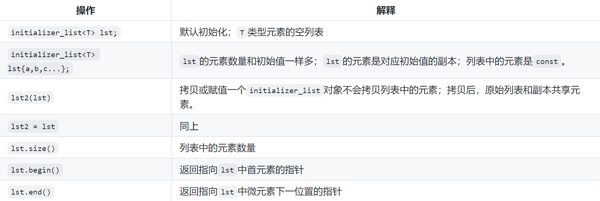

[TOC]
# 条款9、优先考虑别名声明而非typedef


## 9.1、前提知识
1. 类作用域运算符::
    * 定义：便于访问类的成员，包括静态成员变量、普通成员函数和静态成员函数;
    * 用法总结
        * 访问类的静态成员变量和静态成员函数，ClassName::Static_Member;
        * 在类外定义和实现类的成员函数：ReturnType ClassName::memberFun(args);
        * 解决命名冲突（不同命名空间相同名或不同类中相同名）,std::string;
        * 嵌套类的访问，A类嵌套了B类：A::B::memberVar; 或者A类中嵌套了其他类型，即定义了类型成员，A::typeMember;

2. typename关键字（class关键字同义）
    * 定义和使用：通常用在模板编程中告诉编译器某个名称是一个类型成员，而不是非类型成员（静态数据成员、嵌套类或枚举常量）;
        ```cpp
        struct A{
            static int subType;
        };
        struct B{
            typedef int subType;
        };
        template<typename T>
        class C{
        public:
            void f(){
                // 告诉编译器sybType是T类的一种类型成员 而不是静态数据成员/内部嵌套类/
                // 默认情况下c++通过作用域运算符访问的名字是数据成员 不是类型成员
                typename T::subType *p;
            }
        };
        C<A> c1;   // 这句不会报错  因为模板类中的函数只有在用到才会生成
        c1.f();   // 错 A中没有subType的类型
        C<B> c2;
        c2.f();

        ```
## 9.2、using和typedef的区别


## 9.3、对模板来说，using比typedef更好用
1. 语法：using的语法更加直观(像声明变量一样定义类型)，更好理解;
    ```cpp
    using type = int;
    typedef int type;
    ```
2. 模板别名：using可以定义模板别名，在模板中可以大大简化代码并提高可读性；而typedef不可以直接定义模板别名，必须先创建一个类，再在类中声明模板别名（类型成员），代码更复杂，而且在模板类内调用模板别名时，还需要使用typename告诉编译器是类型成员而不是非类型成员（但是在类外调用模板别名时不需要typename，编译器可以通过实际的类自动推导）;
    ```cpp
    // using定义模板别名
    template<typename T>
    using myVector1 = std::vector<T>;

    // typedef定义模板别名
    template<typename T>
    struct myVector2{
        typedef std::vector<T> type;  // 类型别名
    };

    template<typename T>
    class A{
    public:
        myVector1<T> list;
    };

    template<typename T>
    class B{
    public:
        // 调用类中的类型成员 必须使用:: 明确是类型成员 而不是非类型成员（静态数据成员等）
        typename myVector2<T>::type list;
    };

    myVector1<int> myve1 = {1, 2, 3};
    // 但是在类外调用类的类型成员 不需要使用:: 因为这里已经指定了是类myVector2<int>类 
    // 特化后编译器可以通过myVector2<int>来推断type是类型成员还是非类型成员
    myVector2<int>::type myvec2 = {1, 2, 3};
    ```
3. 模板特例化：using  支持模板特化，可以使用using来为模板的特化版本定义类型别名,而typedef不可以;
    ```cpp
    template<typename T>
    struct MyTemplate {
        using Type = T;
    };
    template<>
    struct MyTemplate<int> {
        using Type = double;
    };
    using MyAlias = MyTemplate<char>::Type;  // char 的别名
    using MySpecializedAlias = MyTemplate<int>::Type;  // double 的别名
    ```


## 9.4、类型萃取器
* 导入：#inclue<type_traits>
* 作用：用于添加或删除模板T的修饰;
* 所有可用函数
    
* 示例：
    ```cpp
    // const T -> T
    std::remove_const<T>::type  // c++11
    std::remove_const_t<T>      // c++14
    ```