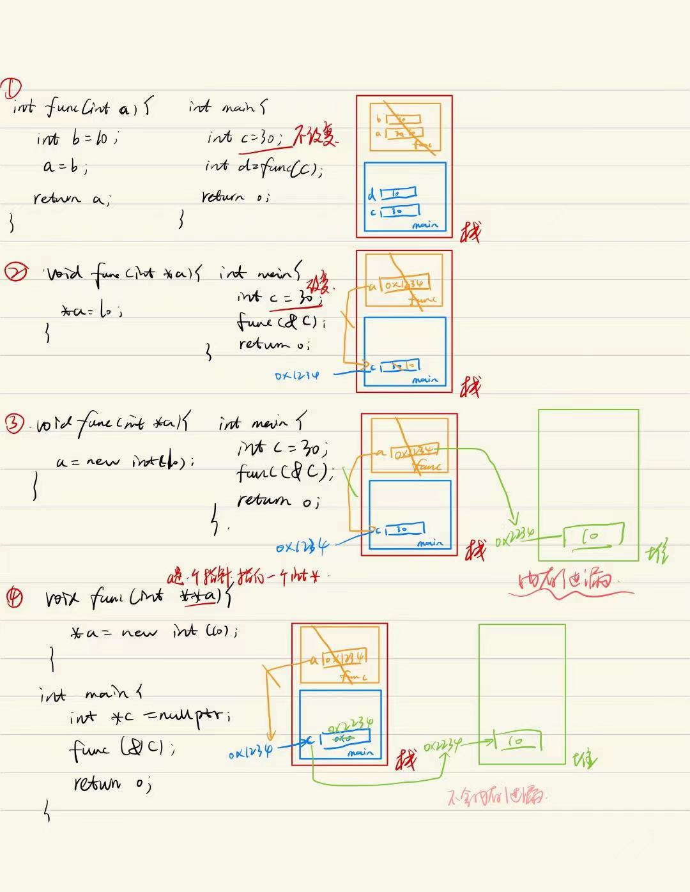
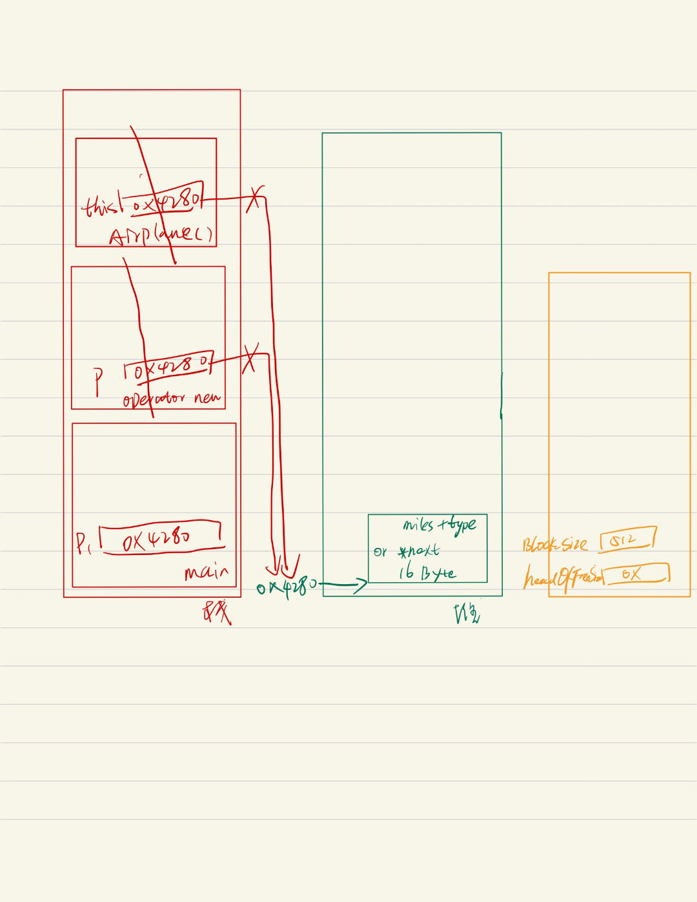
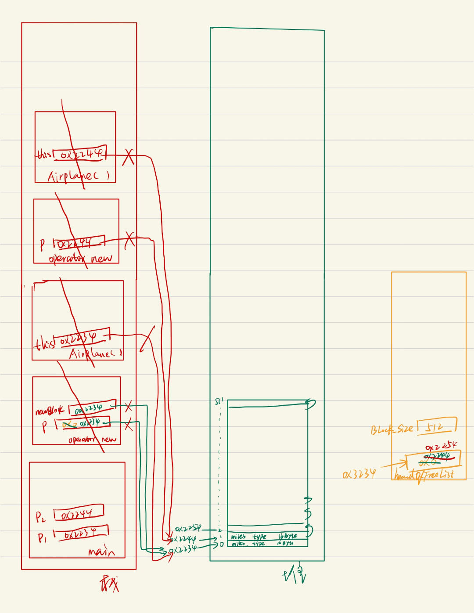
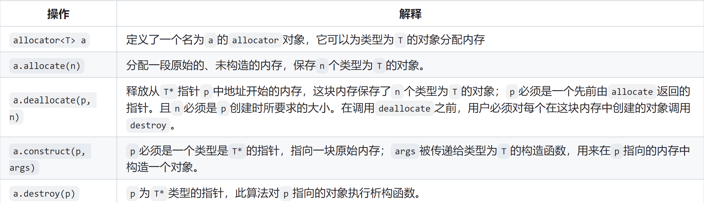
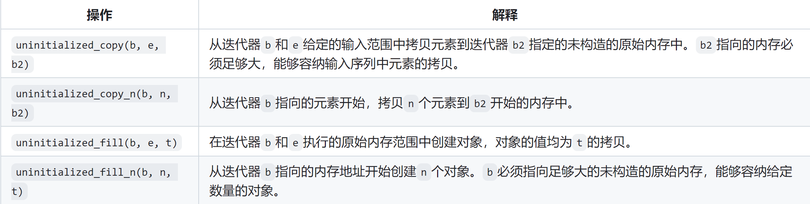

[TOC]
# 基础13、c++内存管理基础
## 13.1、堆栈内存分配流程与内存泄漏
* 栈：存放临时变量，自动释放
* 堆：手动分配的变量，手动释放
    

## 13.2、c++申请内存的各种方法
### 13.2.1、内存的手动申请和释放
* malloc/free: c
    * malloc：单纯为了申请一块堆上指定大小的内存
    * free：单纯为了将堆上这快内存释放掉，但是并没有指定释放内存的大小，所以编译器底层会在malloc申请内存的时候多申请一些空间，用于存放当前这块内存的大小，free的时候就知道需要释放的内存有多大
        ```cpp
        void *p = malloc(512);  // 申请512字节大小的空间 但是底层实际是>512的，需要额外存放这块内存的大小
        free(p);  // free的时候不需要指定free的大小 编译器会读取
        ```
    * 尽量不要频繁的使用malloc（不要频繁的new），正确做法：一次性申请较大内存，然后多次使用这块内存
        * malloc会造成内存浪费
        * malloc是有代价的，比如申请100字节大小的空间，一次性申请100个字节和申请10次10个字节，前者的代价小于后者

* new/delete：c++，因为c++中多了类，在创建对象和销毁对象时需要执行类的构造函数和析构函数，所以c++重新定义了两个函数new和delete，这两个函数既调用了malloc和free，又调用了构造函数和析构函数。
    * new：在自由空间分配的内存是无名的，因此new无法为其分配的对象命名，而是返回一个指向该对象的指针，并执行类构造函数
        ```cpp
        Test *p = new Test();
        // 等价于
        void *mem = malloc(sizeof(Test));  // operator new底层就是调用malloc申请内存空间
        Test *p = (Test*) mem;  // void*强转为Test*
        p->Test::Test();      // 调用构造函数
        ```
    * delete：先执行类析构函数，并销毁new指针指向的对象并释放对应的内存，
        ```cpp
        delete p;
        //  等价于
        p->~Test();           // 执行析构
        operator delete(p);   // 底层调用free(p) 释放内存空间
        ```
    * 使用new和delete管理动态内存常见的三个问题 
        * 内存泄漏，忘记delete由new创建的内存空间
        * 使用已经释放的内存
        * 同一块内存释放两次：两个指针指相同的动态分配对象时，delete掉其中一个对象并释放掉对应内存，剩下一个指针就变成了空悬指针，再次使用这个空悬指针，第二次释放同一块内存，错误

* placement new：不需要额外申请内存，直接在指定内存空间位置构造对象（用的少）
    ```cpp
    // malloc p1;
    Test *p = new(p1) Test();
    // 等价于
    void *mem = operator new(sizeof(Test), p1);  // 什么也不做 直接返回p1的地址 不需要额外什么内存空间 直接在p1指针所指空间操作即可
    Test *p = (Test*) mem;
    p->Test::Test();
    // delete(p)
    ```
### 13.2.2、完全掌握内存的申请与释放
* 重写类内的operator new and delete，构造函数和析构函数不需要我们控制，系统会自动调用
    ```cpp  
    class Test {
    public:
        Test() { std::cout << "Test() addr is: " << this << std::endl; }
        Test(int a): _a(a) {
            std::cout << "Test(int) addr is: " << this << std::endl; 
        }
        ~Test() { std::cout << "~Test() addr is: " << this << std::endl; }

        void* operator new(size_t size) {
            std::cout << "operator new(size_t sie)" << std::endl;
            return malloc(size); 
        }
        void operator delete(void *p) {
            std::cout << "operator delete(void *p)" << std::endl;
            free(p);
        }

        void* operator new(size_t size, void *buf) {
            std::cout << "operator new(size_t size, void *buf)" << std::endl;
            return buf;
        }
        void operator delete(void *ptr, void *buf) {
            std::cout << "operator delete(void *ptr, void *buf)" << std::endl;
            free(ptr);
        }
    private:
        int _a;
    };

    // operator new(size_t sie)
    // Test() addr is: 0xe21d20
    Test *p1 = new Test();
    //~Test() addr is: 0xe21d20
    // operator delete(void *p)
    delete p1;
    std::cout << "===============" << std::endl;
    void *buf = malloc(sizeof(Test));
    // operator new(size_t size, void *buf)
    // Test(int) addr is: 0xe61d20
    Test *p2 = new (buf) Test(500);
    // ~Test() addr is: 0xe61d20
    // operator delete(void *p)
    delete p2;
    ```

### 13.2.3、重写operator new/delete的意义
* 不重写会operator new会分配3个大于size的空间，造成内存浪费。重写operator new可以一次性分配3个类成员的内存，再多次连续使用这段内存，不会造成内存浪费。

* 不重写operator new/delete
    ```cpp
    class Airplane {
    private:
        struct AirplaneRep {
            unsigned long miles{10};  // 8
            char type{'A'};           // 1  -> 16
        };
        union {
            // 节省内存空间 rep和next公用一块内存空间 在用rep的时候不需要用next 在用next的时候不需要用rep
            AirplaneRep rep{};   // 16
            Airplane *next;      // 8    ->   16
        };
        static const int BLOCK_SIZE;
        static Airplane *headOfFreeList;
    public:
        unsigned long getMiles() {
            return rep.miles;
        }
        char getType() { return rep.type; }
        void set(unsigned long m, char t) {
            rep.miles = m;
            rep.type = t;
        }
        ~Airplane() { std::cout << "Airplane::~Airplane()" << std::endl; }
    };

    int main(){
        std::cout << sizeof(Airplane) << std::endl;   // 16
        Airplane *p1 = new Airplane();
        std::cout << p1 << std::endl;     // 0x5612721d8280
        Airplane *p2 = new Airplane();
        std::cout << p2 << std::endl;     // 0x5612721d82a0
        Airplane *p3 = new Airplane();
        std::cout << p3 << endl;          // 0x5612721d82c0
        return 0;
    }
    ```
    

* 重写operator new/delete
    ```cpp
    class Airplane {
    private:
        struct AirplaneRep {
            unsigned long miles{10};  // 8
            char type{'A'};           // 1  -> 16
        };
        union {
            AirplaneRep rep{};   // 16
            Airplane *next;      // 8    ->   16
        };
        static const int BLOCK_SIZE;
        static Airplane *headOfFreeList;
    public:
        unsigned long getMiles() {
            return rep.miles;
        }
        char getType() { return rep.type; }
        void set(unsigned long m, char t) {
            rep.miles = m;
            rep.type = t;
        }
        ~Airplane() { std::cout << "Airplane::~Airplane()" << std::endl; }

        static void *operator new(size_t size);
        static void operator delete(void *ptr);
    };

    Airplane *Airplane::headOfFreeList;
    const int Airplane::BLOCK_SIZE = 512;

    void *Airplane::operator new(size_t size)
    {
        // if (size != sizeof(Airplane))
        // {
        //     return ::operator new(size);
        // }
        Airplane *p = headOfFreeList;
        if (p)
        {
            headOfFreeList = p->next;
        }
        else
        {
            Airplane *newBlock = static_cast<Airplane *>(::operator new(BLOCK_SIZE * sizeof(Airplane)));
            for (int i = 1; i < BLOCK_SIZE - 1; ++i)
            {
                newBlock[i].next = &newBlock[i + 1];
            }
            newBlock[BLOCK_SIZE - 1].next = 0;
            p = newBlock;
            headOfFreeList = &newBlock[1];
        }
        return p;
    }

    void Airplane::operator delete(void *ptr)
    {
        if (ptr == 0)
        {
            return;
        }
        // if (size != sizeof(Airplane))
        // {
        //     ::operator delete(ptr);
        //     return;
        // }
        Airplane *deleteMe = static_cast<Airplane *>(ptr);
        deleteMe->next = headOfFreeList;
        headOfFreeList = deleteMe;
    }

    int main(){
        std::cout << sizeof(Airplane) << std::endl;   // 16
        Airplane *p1 = new Airplane();
        std::cout << p1 << std::endl;     // 0x55e9d5d59280
        Airplane *p2 = new Airplane();
        std::cout << p2 << std::endl;     // 0x55e9d5d59290
        Airplane *p3 = new Airplane();
        std::cout << p3 << endl;          // 0x55e9d5d592a0
        return 0;
    }
    ```
      
    * 使用联合体的好处：rep和next虽然公用一块内存，但是并不是同时使用的，这样可以节省空间  


## 13.3、Array new，Array delete与std::allocator的引入（用的少 c++不推荐使用Array）
* new一个数组的特性和上面的new对象是一样的，一次性new一个数组它的内存利用率会更高
    ```cpp
    // 多次分配 内存利用率不高
    // 0x2671d20
    // 0x2671d40
    // 0x2671d60
    for (int i = 0; i < 3; i++) {
        int *a = new int(10);
        std::cout << a << std::endl;
    }

    // 一次分配 内存利用率高
    // 0x2671d80
    // 0x2671d84
    // 0x2671d88
    int *a = new int[3]{1, 23, 5};
    std::cout << a << std::endl;
    std::cout << a + 1 << std::endl;
    std::cout << a + 2 << std::endl;
    ```
* Array new基础用法
    ```cpp
    int *a = new int[3]{1, 3, 5};
    delete[] a;
    // delete a;  等价
    ```
* 问题：new[]必须就要delete[ ]吗？
    * delete后面的[]是可有可无的，因为new在进行内存分配时，底层是调用malloc函数的，分配了多少内存是会被记录的（底层会申请大于我们申请的内存，用于记录当前对象具体分配了多少空间），否则delete后面也不可能只跟[ ]而不跟具体的个数了
    * 但是也存在不加[]导致内存泄漏的情况：数组元素是类对象，并且这个类有指针成员
        ```cpp
        class Test {
        public:
            Test(int a) {
                ptr = new int(a);
            }
            ~Test() { delete ptr; }
        private:
            int *ptr;
        };

        Test *t = new Test[3]{Test(1), Test(2), Test(3)};
        // delete t;   // 只会调用一次析构 并且会抛出异常
        delete[] t;
        ```

* 重载operator new/delete的弊端
    * 每一个都要重写operator new/delete，太繁琐，代码重复性太高。应该将内存管理的代码单独抽取出来，std::allocator应运而生
* std::allocator：标准库allocator类定义在头文件memory中，帮助我们将内存分配和对象构造分离开
    * 标准库allocator类定义在头文件memory中，帮助我们将内存分配和对象构造分离开
        * 标准allocator类和算法
            
        * 示例
            ```cpp
            int n = 5;
            allocator<string> alloc;    // 定义一个allocator对象，可以为string对象分配内存
            auto const p = alloc.allocate(n);   //  分配n个未初始化的string
            auto q = p;     
            alloc.construct(q++);   // *q=""、q++
            alloc.construct(q++, 5, 'C');   // *q="CCCCC"、q++
            alloc.construct(q++, "hi");     // *q="hi"、q++
            cout << *p << endl;
            cout << *q << endl;   // 未定义 q指向最后构造的元素之后的位置
            // 删除动态数组
            while(q != p)
                alloc.destroy(--q);   // 隐式调用析构函数 销毁每一个元素
            alloc.deallocate(p, n);   // 释放n个string对象的内存
            ```
    * allocator伴随算法
        * 定义在头文件memory中,在给定目的位置创建元素，而不是由系统分配内存给他们
        
        * 示例
            ```cpp
            vector<int> vi = {1, 2, 3};
            allocator<string> alloc;
            auto p = alloc.allocate(vi.size()*2);  // 6个元素空间
            // 前三个空间填充123  q指向第四个空间
            auto q = uninitialized_copy(vi.begin(), vi.end(), p);
            // 后三个空间填充42
            uninitialized_fill_n(q, vi.size(), 42);
            ```

