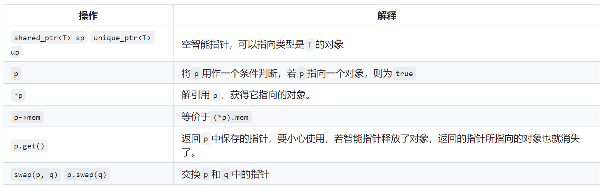
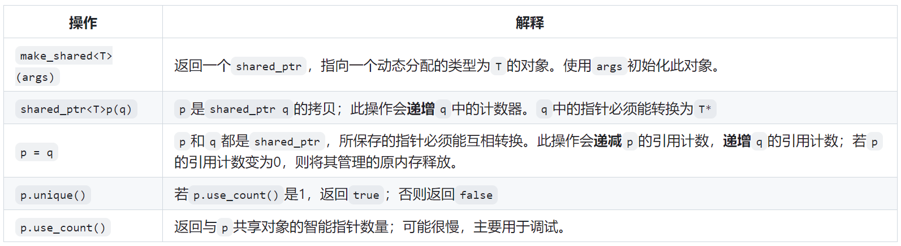
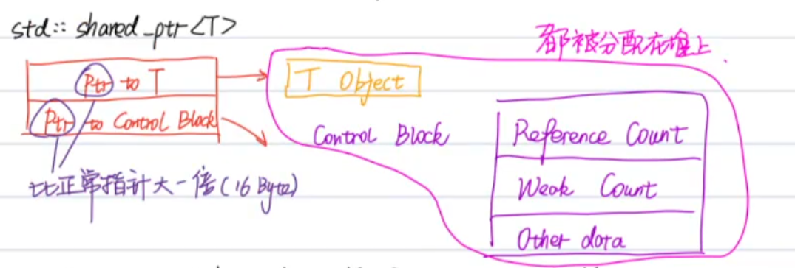
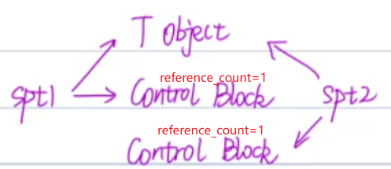

[TOC]
# 条款19、对于共享资源使用std::shared_ptr
基础：base13


## 19.1、unique_ptr的基础内容
主要是c++ primer中的内容

* 简单使用：智能指针也是模板，因此在使用时必须提供智能指针所指向的类型
    ```cpp
    shared_ptr<string> p1;  // 定义一个共享智能指针p1,指向string对象,该对象为空字符串
    shared_ptr<list<int>> p2; // 定义一个共享智能指针p2,指向int的list对象,list中所有元素都0
    ```
* shared_ptr最安全的使用方法是调用make_shared标准库函数，该函数可以在动态内存中分配一个对象并根据提供的参数初始化这个对象，返回指向这个对象的shared_ptr指针;
    ```cpp
    // 定义一个共享智能指针p3 指向一个值为42的int对象
    shared_ptr<int> p3 = make_shared<int>(42);    
    // 定义一个共享智能指针p4 指向一个值为"999"的string对象
    shared_ptr<string> p4 = make_shared<string>(3, '9');
    // 定义一个共享智能指针p5 指向一个默认值为0的int对象
    shared_ptr<int> p5 = make_shared<int>();
    // auto+make_shared是更常见的一种组合方式，简单有效
    auto p6 = make_shared<string>();
    ```
* shared_ptr的一些常见操作
    * shared_ptr和unique_ptr都支持的操作
        
    * shared_ptr独有的操作
         

* 引用计数
    * 当进行拷贝或赋值操作时，每个对象都会通过引用计数器记录有多少个其他shared_ptr指向当前对象。当拷贝一个shared_ptr时, 引用计数器会增加, 当给shared_ptr赋值一个新值或者shared_ptr被销毁，计数器会递减。
        ```cpp
        auto p = make_shared<int>(42);  // p指向值为42的int对象，引用计数器cnt1=1
        auto p(q);  // p也指向q指向的对象 此时cnt1=0 cnt2=2
        
        // shared_ptr指针r指针指向值为42的int对象
        auto r = make_shared<int>(42);
        // 递增q所指向对象的引用计数器cnt1
        // 递减r原来所指向的对象的引用计数器cnt2 如果cnt2=0 释放r
        r = q;
        ```


* shared_ptr可以自动销毁所管理的对象，还会自动释放相关联的内存
    * 当指向一个对象的最后一个shared_ptr指针被销毁时，shared_ptr会自动通过调用析构函数销毁此对象：析构函数会递减它所指向的对象的引用计数，如果引用计数为0，shared_ptr的析构函数再销毁这个对象;
    * 当动态对象不再使用时，shared_ptr类会自动释放动态对象，如在函数中定义了一个shared_ptr指针，因为shared_ptr其实是一个类对象，那么当这个类对象离开这个函数作用域，编译器会自动调用这个类对象的析构函数，析构函数会自动释放资源;
        ```cpp
        shared_ptr<int> factory(int arg){
            return make_shared<int>(arg);
        } 
        void use_factory(int arg){
            shared_ptr<int> p = factory(arg);  // 定义shared_ptr指针p
        }  // 当p指针离开函数作用域 p指针被销毁 此时它所指向对象引用计数为0
           // p所指向的动态对象也会被销毁  动态对象所占用的内存也被自动释放掉
        ```


## 19.2、effective modern c++进阶知识
* shared_ptr< T>的内存模型
    * 大小是一般指针的两倍（16 bytes）,内部存放一个指向T类型的指针和一个指向控制块(control block)的指针，两个指针都是指向堆上的内容
    * 控制块（在堆上new出来的）包括一个引用Reference Count、weak Count和other data(存放一些分配器和删除器)
    
    * 和unique_ptr在内存上的区别: 删除器是unique_ptr的一部分，但是对于shared_ptr不是（shared_ptr永远是16字节，保存两个指针，而删除器是被放在other data中的），所以自定义删除器并不会影响shared_ptr的大小
        ```cpp
        auto loggingDel = [](Widget *pw) { makelogEntry(pw); delete pw; }  // 自定义删除器
        std::unique<Widget, decltype(loggingDel)> upw(new Widget, loggingDel); // 自定义删除器是unique_ptr是其一部分
        std::shared_ptr<Widget> spw(new Widget, loggingDel);  // 自定义删除器不是shared_ptr的一部分
        ```

* shared_ptr的性能问题
    * 大小是原始指针的两倍
    * 引用计数内存必须动态分配（Reference Block是在堆上new出来的，需要调用malloc函数，会浪费一点点空间，所以有一些性能的开销）
    * 引用计数的增减必须是原子的（多线程 不太懂 后续学完多线程再学习）

* control block的生成时机（重要）
    * 使用std::make_shared时
    * 通过unique_ptr构造shared_ptr时
    * 向shared_ptr的构造函数传入一个裸指针时

* shared_ptr可能存在的问题（重要）
    * T Object和Control Block是关联在一起的（虽然物理内存不连续），如果两个Control Block与同一个Object关联，那么大概率会有多次释放的风险
        ```cpp
        auto pt = new Test;
        // shared_ptr spt1传入一个裸指针pt，生成一个control block1
        std::shared_ptr<Test> spt1(pt);
        // shared_ptr spt2再传入一个裸指针pt，生成一个control block2
        std::shared_ptr<Test> spt2(pt);
        // 此时同一个指针pt会关联两个control block，当释放spt2时，pt被释放，control block2中引用计数为0，但是control block1中引用计数还是1，代码崩溃
        ```
        
    * 解决办法
        ```cpp
        // shared_ptr spt1传入一个裸指针pt，生成一个control block1
        std::shared_ptr<Test> spt1(new Test);
        // 拷贝构造不会创建新的control block，两个智能指针指向同一个T和control block
        std::shared_ptr<Test> spt2(sp1);
        ```

* this指针作为std::shared_ptr构造函数实参
    * 实例
        ```cpp
        class Widget;
        std::vector<std::shared_ptr<Widget>> processwidgets;

        class Widget {
        public:
            void process() {
                // 调用shared_ptr构造函数传入一个裸指针 创建一个control block
                processwidgets.emplace_back(this);
            }
        };

        // 创建一个control block
        auto w = std::make_shared<Widget>();
        w->process();
        // 报错  两次释放
        // double free or corruption (out)
        // Aborted
        ```
    * 解决方法：还是有问题
        ```cpp
        class Widget;
        std::vector<std::shared_ptr<Widget>> processwidgets;

        // 奇异递归模板模式CRTP
        class Widget: public std::enable_shared_from_this<Widget> {
        public:
            void process() {
                processwidgets.emplace_back(shared_from_this());
            }
        };

        // 创建一个control block
        auto w = std::make_shared<Widget>();
        w->process();  // 成功

        // 错误
        Widget w2;
        w2.process()  
        ```
    * 最终版本（实际开发会用到）
        ```cpp
        class Widget;
        std::vector<std::shared_ptr<Widget>> processwidgets;

        // 奇异递归模板模式CRTP
        class Widget: public std::enable_shared_from_this<Widget> {
        public:
            template <typename... Ts>
            static std::shared_ptr<Widget> create(Ts &&...params) {
                return std::shared_ptr<Widget>(new Widget(std::forward<Ts>(params)...));
            }
            void process() {
                processwidgets.emplace_back(shared_from_this());
            }
        private:
            int _data;
            Widget(int data): _data(data) {
                std::cout << "Widget(int data)" << std::endl;
            }
        };

        std::cout << "hello world" << std::endl;
        // 创建一个control block
        auto w = Widget::create(1);
        w->process();  // 成功
        ```

* shared_ptr不支持数组，sharted_ptr< T[]>没有这种写法，可以用std::vector/std::array