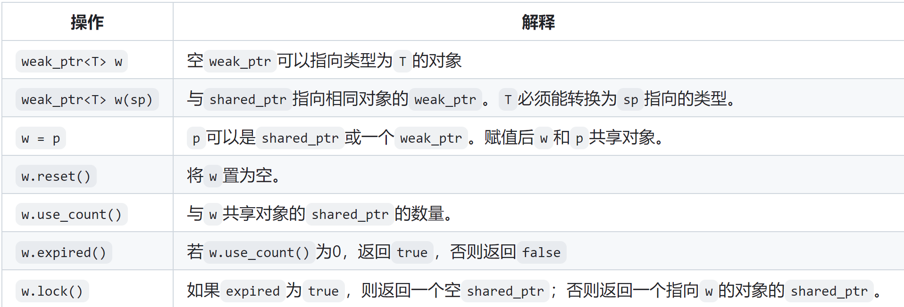
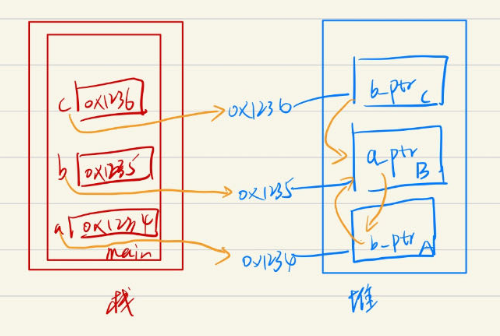

[TOC]
# 条款20、当std::shared_ptr可能悬空时使用std::weak_ptr
基础：base13、item19

## 19.1、unique_ptr的基础内容
主要是c++ primer中的内容
* weak_ptr是一种不受控制所指向对象生存期的智能指针，它指向一个shared_ptr，但不会改变shared_ptr的引用计数;
    ```cpp
    auto p = make_shared<int>(42);
    // wp弱共享p, p的引用计数不变
    weak_ptr<int> wp(p);
    ```
* 一旦最后一个指向对象的shared_ptr被销毁，对象就会被释放，不管有没有weak_ptr指向该对象；

* weak_ptr的操作
    

## 20.2、effective modern c++进阶知识
* weak_ptr不能单独使用，通常要从std::shared_ptr上创建
    * 实例
        ```cpp
        // 使用make_shared创建shared_ptr，引用计数为1
        auto sptr = std::make_shared<Widget>();  
        // 创建一个weak_ptr，指向sptr相同的Widget对象 但是不改变sptr的引用计数
        std::weak_ptr<Widget> wptr(sptr);  
        sptr = nullptr;  // sptr中引用计数为0，Widget对象被销毁 此时wptr还存在 且悬空
        ```
    * 虽然weak_ptr不能掌握所指向对象(Widget)的生死,但是可以知道它是否存在
        ```cpp
        wptr.expired(); // 返回true表示资源已经释放
        // 将weak_ptr对象转为shared_ptr对象，如果sptr1为空 说明资源已经释放
        std::shared_ptr<Widget> sptr1 = wptr.lock();  
        std::shared_ptr<Widget> sptr2(wptr);   // 如果资源已经释放则抛出异常 无法赋值
        ```
* std::weak_ptr的作用1：监视者
    * 实例
        ```cpp
        class Widget {
        public:
            Widget(int id) : _id(id) {std::cout << "Widget(int id)" << std::endl; }
            ~Widget() { std::cout << "Widget(int id)" << std::endl; }
        private:
            int _id{-1};
        };

        std::shared_ptr<const Widget> loadWidget(int id) {
            // 假设加载类Widget对象会非常耗时
            std::shared_ptr<const Widget> uptr{new Widget(id)};
            return uptr;
        }
        // 缓冲区 存放每一个已经用过的shared_ptr对象 这个cache使用weak_ptr 监视者 不需要拥有对象的控制权
        // 每次需要使用id号的Widget时 先去缓冲区里找有没有 有直接返回 没有就创建 再加入缓存区
        static std::unordered_map<int, std::weak_ptr<const Widget>> cache;

        std::shared_ptr<const Widget> fastLoadWidget(int id) {
            auto objPtr = cache[id].lock();  // 监视 看cache中有没有std::shared<const Widget>(id)对象
            if (!objPtr) {
                // 如果堆中没有std::weak_ptr<Widget(id)>这个对象 就创建一个std::shared_ptr<const Widget>对象objPtr
                objPtr = loadWidget(id);
                // 再std::weak_ptr<const Widget>(objPtr) 以此监视这个shared_ptr对象objPtr
                cache[id] = objPtr;
            }
            return objPtr;
        }
        ```
    * 注意：这里的cache是weak_ptr而不是shared_ptr是有原因的
        ```cpp
        // 如果cache是shared_ptr时
        // 创建share_ptr对象widgetSptr，指向堆中Widget(0)这个对象  再创建一个share_ptr对象 也指向这个 存放在cache中 此时reference_count = 2
        auto widgetSptr = fastLoadWidget(0);
        // 此时widgetSptr对象重新指向堆中Widget(1)这个对象 原始的Widget(0)对象应该被释放掉 
        // 但是cache中携带了一个shared_ptr<Widget>(1), 此时reference_count=1 无法释放
        widgetSptr = fastLoadWidget(1);
        ```

* std::weak_ptr的作用2：解决循环引用造成的内存泄漏问题
    * 实例
        ```cpp
        class A { public: std::shared_ptr<B> b_ptr; };
        class B { public: std::shared_ptr<A> a_ptr; };
        class C { public: std::shared_ptr<B> b_ptr; };
        int main() {
            auto b = std::make_shared<B>();
            auto a = std::make_shared<A>();
            auto c = std::make_shared<C>();
            a->b_ptr = b;
            c->b_ptr = b;
            b->a_ptr = a;
            return 0;
        }
        ```
         
        当main函数执行完毕，a、b、c被释放，然后C b_ptr没有指向它的指针也被释放，但是B a_ptr和A b_ptr相互指向，无法释放，造成内存泄漏
    * 解决办法：将B a_ptr或A b_ptr其中一个改为weak_ptr
