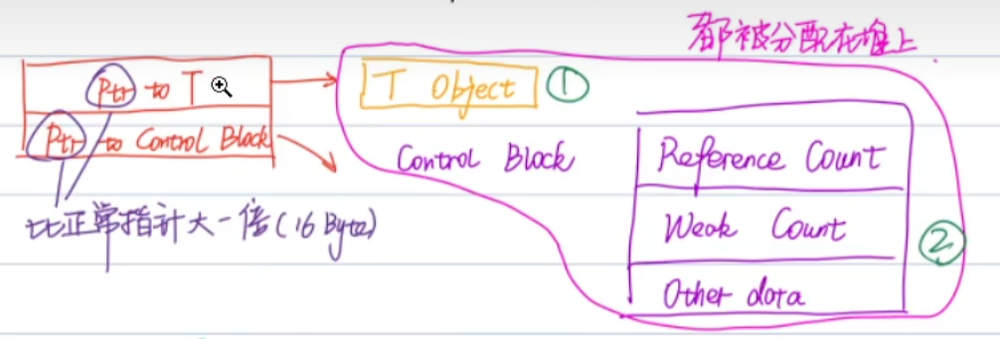

[TOC]
# 条款20、优先考虑使用std::make_shared和std::make_unique而非new

* 不需要和new一样手动释放内存

* 可以减少代码重复
    ```cpp
    // std::make_unique直接创建并返回一个通过构造函数初始化的Widget对象  一次赋值
    auto uptr1(std::make_unique<Widget>()); 
    // 首先使用new创建一个指向Widget对象的指针
    // 然后将这个指针传递给std::unique_ptr<Widget>的构造函数进行赋值  赋值两次
    std::unique_ptr<Widget> uptr2(new Widget);  
    ```

* 更安全
    ```cpp
    // 声明
    void processWidget(std::shared_ptr<Widget>sptr, int priority);
    // 调用
    // 3: std::shared_ptr<Widget>  1: new Widget  2: computePriority()
    // 1先执行 但是2和3调用的顺序不确定 
    // 如果是2先执行 且抛出了异常 此时shared_ptr没有对Widget对象进行正确释放 很容易发生内存泄漏
    processWidget(std::shared_ptr<Widget>(new Widget), computePriority());
    // 问题的本质：1和3被2抛出异常打断了
    // 修改方法1: 此时1和3操作合并 即使computepriority抛出异常，要么已经释放Widget对象，要么还没有创建 不会有内存泄漏问题
    processWidget(std::make_shared<Widget>(), computepriority());
    // 修改方法2
    std::shared_ptr<Widget> sptr(new Widget);
    processWidget(std::move(sptr), computePriority());
    ```

* std::shared_ptr和new相比有效率上的提升，std::make_unique和new效率是差不多的
    * 如图一个shared_ptr内存中的1和2都会被分配到堆上，如果使用new，需要在堆上申请两次内存（先new对象，申请1的内存空间，再将new出来的指针赋值给shared_ptr，此时再申请2的内存空间），而使用make_shared会一次性的分配1和2
    

* make_shared和make_unique的局限性(a、b是两者通病，c、d是make_shared独有的)
    * a、使用自定义删除器时，只能使用new
    * b、无法通过{}初始化执行的对象（原因{}无法完美转发，item30）
        ```cpp
        auto uptr = std::make_unique<std::vector<int>>({10, 20});  // 错
        ```
    * c、如果类中重载了operator new/delete，使用make_shared不会执行重载函数，此时只能使用shared_ptr或std::allocated_shared
    * d、使用make_shared时，T object和control block会一起申请，同时也会一起释放，所以当weak_ptr存在时，对象的销毁（析构函数执行）与内存的释放（T object和control block）之间间隔时间可能很长（在weak_ptr销毁时，内存才会释放，因为weak_ptr是和control block相关的）
        ```cpp
        auto sptr = std::make_shared<Widget>();
        std::weak_ptr<Widget> wptr(sptr);
        // 此时会执行Widget类析构函数，销毁Widget对象，但是T object和control block内存会在weak_ptr销毁时才会释放
        sptr = nullptr;
        ```