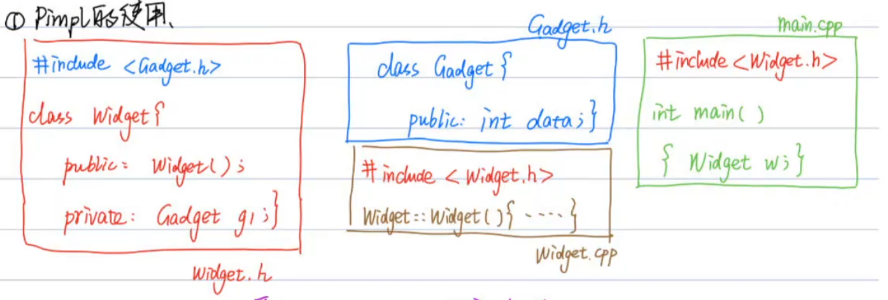
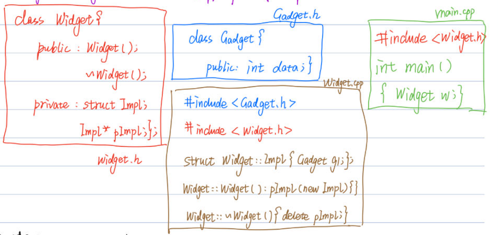

[TOC]
# 条款22、当使用Pimpl惯用法，请在实现文件中定义特殊成员函数

* 我们常用的项目文件错误写法
    * 实例
        
        然后CMakeLists中编译main.cpp和Widget.cpp两个文件
    * 存在的两个问题
        * 1）如果Gadget.h只有改动一点，2个cpp文件都要重新编译，编译成本高
        * 2）如果这段代码给别人用，需要给别人Gadget.h和Widget.h两个文件，代码实现的细节暴露过多（private全部被看到，别人完全可以根据代码猜出你是怎么实现的），不安全
        
* Pimpl的使用
    * 实例
        
    * 好处
        * 给用户的Widget.h中，private中的信息完全看不出具体的实现细节，很安全
        * Widget.h中不再包含Gadget的信息，改动Gadget.h文件不会影响Widget.h，只需要重新编译Widget.cpp一个文件
    * 注意点
        * private中的Impl *plmpl必须用指针，因为此时Impl只有声明，编译器并不知道Impl到底有多大，不知道分配多大的内存，所以用指针最好（8字节）

* 使用unique_ptr改写Pimpl
    * 背景：从上节在知道Pimpl写法有诸多好处，但是需要在类的private中引入一个指向Pimpl类的指针，这就需要我们在改类的构造函数和析构函数手动指向new和delete操作，这是繁琐的，所以我们引入智能指针来管理这个指向Pimpl的指针
    * Gadget.h
        ```cpp
        #pragma once

        struct Gadget{
            int data;
        };
        ```
    * Widget.h
        ```cpp
        #include <vector>
        #include <string>
        #include <memory>
        #include <iostream>

        class Widget{
        public:
            Widget();
            // 这个位置的析构函数必须只是声明 定义要在.cpp中实现
            ~Widget(); 
            Widget(Widget &&rhs);
            Widget &operator=(Widget &&rhs);

        private:
            // 现在Widget类的private部分只包含一个指向Impl的类对象的指针 具体的实现细节放在Impl类当中 用户拿到Widget.h就看不到实现逻辑了
            struct Impl;  // 声明Impl类
            std::unique_ptr<Impl> pImpl;  // 只有一个指针类型的私有数据成员
        };
        ```
    * Widget.cpp
        ```cpp
        #include "Widget.h"
        #include "Gadget.h"

        // 实现Impl类，主要存放之前放在private中的一些隐私数据 不希望用户看到 所以写在这个Impl类中
        struct Widget::Impl{
            std::string name;
            std::vector<double> data;
            Gadget g1, g2, g3;
        };

        // Widget类构造函数
        Widget::Widget(): pImpl(std::make_unique<Impl>()) {}
        // Widget类析构函数实现一定要在.cpp中
        Widget::~Widget() = default;
        Widget::Widget(Widget &&rhs) = default;
        Widget &Widget::operator=(Widget &&rhs) = default;
        ```
    * main.cpp
        ```cpp
        #include "Widget.h"

        int main() {
            Widget w;
            Widget w2(std::move(w));
            return 0;
        }
        ```
    * 注意事项
        1. 使用Pimpl类所在的头文件中类的析构函数必须是声明的，而不能是定义的：因为使用unique_ptr析构的时候，默认删除器会使用delete来销毁内置与unique_ptr的原始指针，但是在析构之前，编译器会调用c++11的特性static_assert来确保原始指针指向的类型不是一个未完成类型；
        2. 移动构造和移动赋值也同理：移动构造和移动赋值都需要将将亡对象释放掉，依然需要调用析构函数delete，同1

* 使用shared_ptr改写Pimpl：把上面unique_ptr的位置全部改为shared_ptr即可，可以根据shared_ptr和unique_ptr的优缺点再根据本身项目需求进行选择


